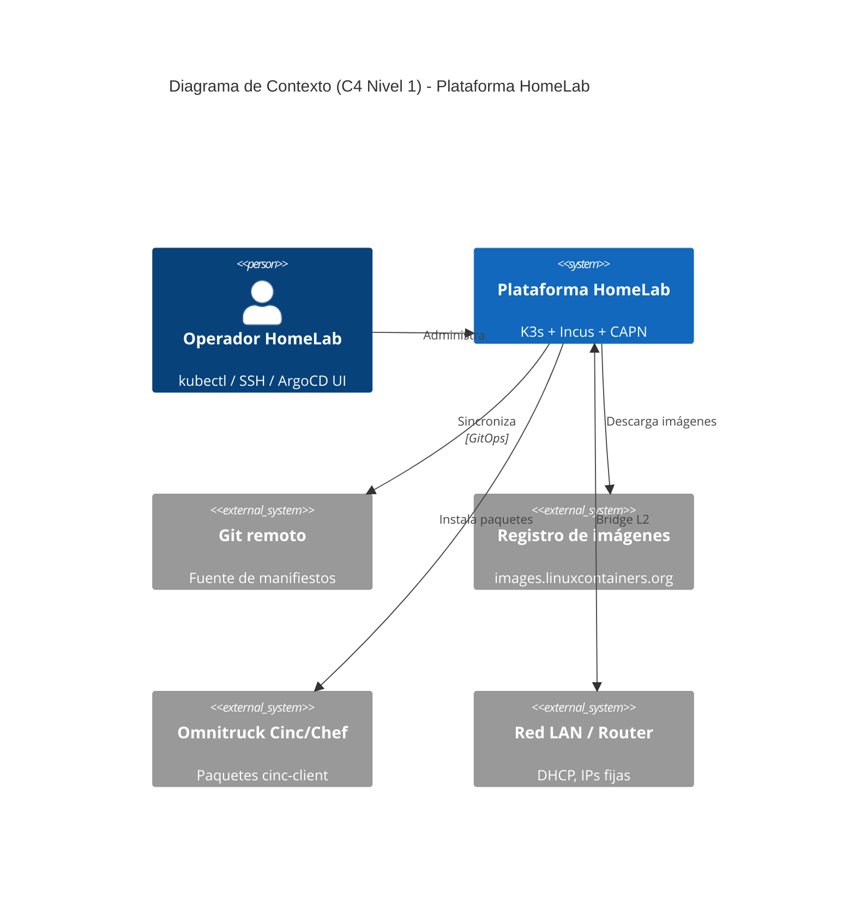

# 🏠 HomeLab — K3s + Incus + CAPN

📖 **Documentación publicada:** https://homelab.symintelligent.com/

Documentación y código de infraestructura de mi HomeLab: un clúster Kubernetes
híbrido (x86_64 + ARM64) construido sobre Incus, con Cluster API (CAPN) para
provisionar clusters efímeros bajo demanda. Este README es la portada del
repo; la documentación navegable completa (con búsqueda) vive en el sitio
de GitHub Pages generado por MkDocs.

## Hardware

| Nodo | Modelo | CPU | RAM (medida) | IP | Rol |
|---|---|---|---|---|
| `invincible` | Lenovo ThinkCentre M920q | x86_64 i3-6100T | 7.6 GB | 192.168.20.6 | Incus leader / K3s worker |
| `oliver` | Lenovo ThinkCentre M700 | x86_64 i7-8700T | 15.5 GB | 192.168.20.7 | Incus (quorum) / K3s worker |
| `deborah` | Orange Pi 5 Plus | ARM64 RK3588 | 31 GB | 192.168.20.5 | K3s control-plane |

Detalle completo en [`docs/hardware/inventory.md`](docs/hardware/inventory.md).

> Los hostnames de los nodos (`invincible`, `oliver`, `deborah`, ...) siguen
> la serie de cómics/animación *Invincible* — ver
> [personajes](https://invincible.fandom.com/es/wiki/Categor%C3%ADa:Personajes).

## Arquitectura



Diagramas completos (Nivel 1 y 2) en [`docs/architecture/`](docs/architecture/).

## Estructura del repo

```
.
├── docs/                  # documentación (fuente de verdad humana, publicada en Pages)
├── mkdocs.yml             # config del sitio MkDocs
├── ansible/               # bootstrap bare-metal: Incus, netplan, K3s, kube-vip, ArgoCD controller
├── opentofu/              # recursos declarativos de Incus (perfiles, redes, cluster groups)
├── cinc-lab/              # cookbooks de prueba para el sandbox Cinc/Chef
└── .github/workflows/     # CI: deploy de docs + lint
```

## Sitio de documentación (MkDocs + GitHub Pages)

`docs/` se publica automáticamente como sitio estático vía GitHub Actions
(`.github/workflows/deploy-docs.yml`) en cada push a `main` que toque
`docs/`, `mkdocs.yml` o `requirements.txt`. Índice completo, con búsqueda,
en el sitio publicado (link arriba).

**Desarrollo local:**
```bash
pip install -r requirements.txt
mkdocs serve   # http://127.0.0.1:8000, con recarga en vivo
```

## Estado

🚧 En construcción activa — guía MkDocs y playbooks Ansible listos; bootstrap
bare-metal (Incus, K3s, GitOps) sigue el recorrido en
[`docs/implementacion/`](docs/implementacion/). K3s v1.36.2 documentado; CNI
default Flannel; CAPN y vCluster opcionales (sync manual).
