# Ansible — catálogo de roles

Inventario de roles en [`ansible/roles/`](https://github.com/symintel/homelab/tree/main/ansible/roles). Cada rol tiene
su `README.md` con variables, tags y verificación.

!!! tip "¿De cero a nodo operativo?"
    Esta página es el catálogo por rol/fase. El **orden completo** para
    llevar un nodo de bare-metal a operativo (incluye hardening,
    BIND, WiFi — hoy fuera de las fases 1-4 de abajo) está en
    [`ansible/bootstrap/README.md`](https://github.com/symintel/homelab/blob/main/ansible/bootstrap/README.md).

## Por fase de implementación

| Fase | Rol(es) | Playbook |
|---|---|---|
| [1 — Red](../implementacion/fase-1-red.md) | `netplan_bridge` | `playbook-set-static-ip.yml` |
| [2 — Incus](../implementacion/fase-2-incus.md) | `incus_install`, `incus_cluster`, `incus_ui` | `playbook-bootstrap.yml` + `playbook-incus-cluster.yml` |
| [3 — K3s](../implementacion/fase-3-k3s.md) | `k3s_*` (10 roles) | `playbook-k3s.yml` |
| [4 — GitOps](../implementacion/fase-4-gitops.md) | — (playbook inline) | `playbook-dex-oauth-secrets.yml` |

## Roles

| Rol | Propósito | Playbook | Tags |
|---|---|---|---|
| [`netplan_bridge`](https://github.com/symintel/homelab/blob/main/ansible/roles/netplan_bridge/README.md) | IP fija en `br0` (Netplan) y `/etc/resolv.conf` estático | `playbook-set-static-ip.yml` | — |
| [`incus_install`](https://github.com/symintel/homelab/blob/main/ansible/roles/incus_install/README.md) | Paquete Incus (Zabbly) | `playbook-bootstrap.yml` | — |
| [`incus_cluster`](https://github.com/symintel/homelab/blob/main/ansible/roles/incus_cluster/README.md) | Bootstrap/join/groups Incus | `playbook-incus-cluster.yml` | `bootstrap`, `join`, `groups`, `scheduler` |
| [`incus_ui`](https://github.com/symintel/homelab/blob/main/ansible/roles/incus_ui/README.md) | UI nativa Incus | `playbook-incus-cluster.yml` | `ui` |
| [`bind_dns`](https://github.com/symintel/homelab/blob/main/ansible/roles/bind_dns/README.md) | BIND en deborah: DNS de la LAN y zonas `mco.local` | `playbook-bind-dns.yml` | — |
| [`k3s_prereqs`](https://github.com/symintel/homelab/blob/main/ansible/roles/k3s_prereqs/README.md) | Swap, módulos kernel, sysctl, requisitos de Longhorn (open-iscsi, NFS) | `playbook-k3s.yml` | `prereqs`, `always` |
| [`k3s_server`](https://github.com/symintel/homelab/blob/main/ansible/roles/k3s_server/README.md) | Control-plane K3s | `playbook-k3s.yml` | `server`, `core` |
| [`k3s_cni`](https://github.com/symintel/homelab/blob/main/ansible/roles/k3s_cni/README.md) | CNI Canal/Calico/Cilium | `playbook-k3s.yml` | `cni`, `core` |
| [`k3s_agent`](https://github.com/symintel/homelab/blob/main/ansible/roles/k3s_agent/README.md) | Workers K3s | `playbook-k3s.yml` | `agent`, `core` |
| [`k3s_kube_vip`](https://github.com/symintel/homelab/blob/main/ansible/roles/k3s_kube_vip/README.md) | VIP API `:6443` | `playbook-k3s.yml` | `kube_vip` |
| [`k3s_cleanup_traefik`](https://github.com/symintel/homelab/blob/main/ansible/roles/k3s_cleanup_traefik/README.md) | Limpia Traefik/svclb | `playbook-k3s.yml` | `traefik` |
| [`k3s_node_labels`](https://github.com/symintel/homelab/blob/main/ansible/roles/k3s_node_labels/README.md) | Etiquetas de nodos | `playbook-k3s.yml` | `labels` |
| [`k3s_argocd`](https://github.com/symintel/homelab/blob/main/ansible/roles/k3s_argocd/README.md) | Controller Argo CD | `playbook-k3s.yml` | `argocd`, `gitops` |
| [`k3s_fetch_kubeconfig`](https://github.com/symintel/homelab/blob/main/ansible/roles/k3s_fetch_kubeconfig/README.md) | Kubeconfig local | `playbook-k3s.yml` | `kubeconfig` |
| [`k3s_os_hardening`](https://github.com/symintel/homelab/blob/main/ansible/roles/k3s_os_hardening/README.md) | unattended-upgrades | `playbook-k3s.yml` | `hardening` |
| [`host_hardening`](https://github.com/symintel/homelab/blob/main/ansible/roles/host_hardening/README.md) | SSH, cuentas default, sysctl, auditd | `playbook-hardening.yml` | — |
| [`wifi_failover`](https://github.com/symintel/homelab/blob/main/ansible/roles/wifi_failover/README.md) | WiFi de respaldo del cable (nodos con WiFi) | `playbook-wifi-failover.yml` | — |
| [`storage_provision`](https://github.com/symintel/homelab/blob/main/ansible/roles/storage_provision/README.md) | Formatea y monta un disco libre (destructivo) | `playbook-storage-provision.yml` | — |

## Playbooks sin rol (tareas inline)

| Playbook | Fase | Descripción |
|---|---|---|
| [`setup_sudo.yml`](https://github.com/symintel/homelab/blob/main/ansible/bootstrap/setup_sudo.yml) | Día 0 | Instala python3 y sudo y deja a `amaceo` con sudo (conecta como root) |
| [`playbook-discovery.yml`](https://github.com/symintel/homelab/blob/main/ansible/playbook-discovery.yml) | 0 | Inventario hardware → `ansible/reports/` |
| [`playbook-incus-cluster.yml`](https://github.com/symintel/homelab/blob/main/ansible/playbook-incus-cluster.yml) | 2 | Bootstrap/join/groups/UI Incus |
| [`playbook-dex-oauth-secrets.yml`](https://github.com/symintel/homelab/blob/main/ansible/playbook-dex-oauth-secrets.yml) | 4 | OAuth Dex: 1Password + ArgoCD + Incus/vCluster |
| [`playbook-rotate-root-passwords.yml`](https://github.com/symintel/homelab/blob/main/ansible/playbook-rotate-root-passwords.yml) | Seguridad | Rota password de root → 1Password (bóveda HomeLab) |
| [`playbook-uninstall-k3s.yml`](https://github.com/symintel/homelab/blob/main/ansible/playbook-uninstall-k3s.yml) | Apéndice | Desinstala K3s en los 3 nodos |

Documentación OAuth: [`gitops/argocd/secrets/1password.md`](https://github.com/symintel/gitops/blob/main/argocd/secrets/1password.md)

## Orden de ejecución K3s

```mermaid
flowchart LR
  prereqs[k3s_prereqs] --> server[k3s_server]
  server --> cni[k3s_cni_opcional]
  cni --> kube_vip[k3s_kube_vip_opcional]
  server --> kube_vip
  kube_vip --> agent[k3s_agent]
  agent --> traefik[k3s_cleanup_traefik]
  traefik --> labels[k3s_node_labels_opcional]
  labels --> argocd[k3s_argocd_opcional]
  argocd --> kubeconfig[k3s_fetch_kubeconfig_opcional]
  kubeconfig --> hardening[k3s_os_hardening_opcional]
```

## Configuración global

| Archivo | Contenido |
|---|---|
| [`group_vars/incus_cluster/k3s_install.yml`](https://github.com/symintel/homelab/blob/main/ansible/group_vars/incus_cluster/k3s_install.yml) | Flags del playbook K3s |
| [`group_vars/dex_oauth_secrets.yml`](https://github.com/symintel/homelab/blob/main/ansible/group_vars/dex_oauth_secrets.yml) | OAuth Dex |
| [`group_vars/incus_cluster/vars.yml`](https://github.com/symintel/homelab/blob/main/ansible/group_vars/incus_cluster/vars.yml) | Storage Incus, groups, UI |
| [`group_vars/all.yml`](https://github.com/symintel/homelab/blob/main/ansible/group_vars/all.yml) | Gateway, IP control-plane |
| [`host_vars/*.yml`](https://github.com/symintel/homelab/tree/main/ansible/host_vars) | Labels, kubelet args por nodo |

## Referencias

- [Opciones del playbook K3s](../k3s/playbook-options.md)
- [Guía de implementación](../implementacion/index.md)
