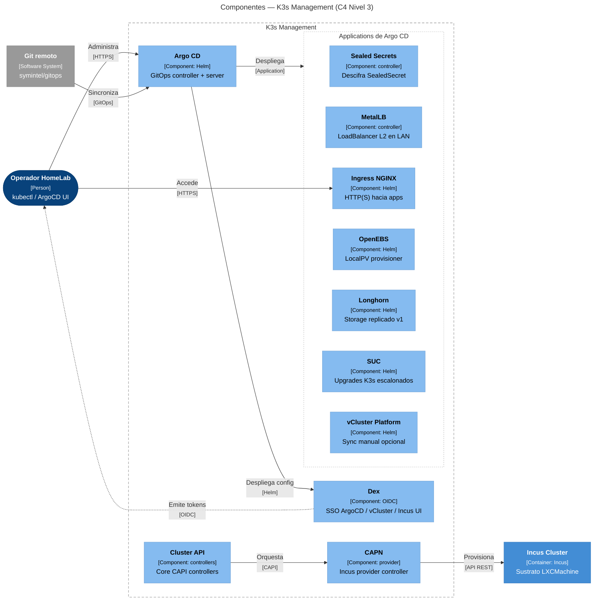
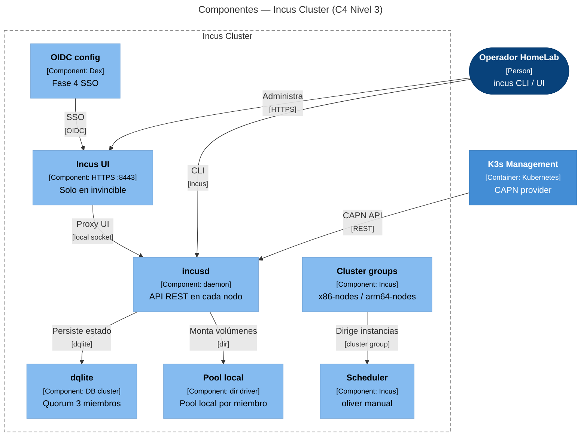
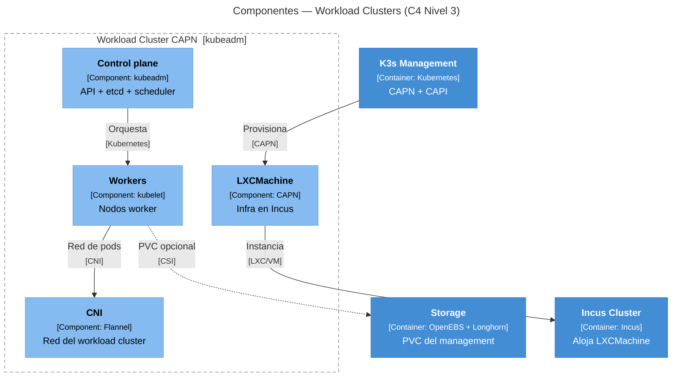
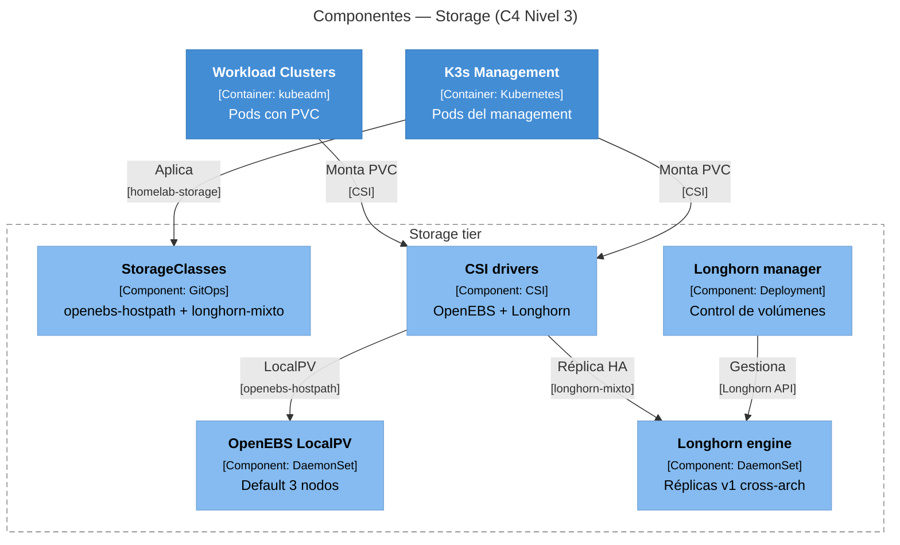
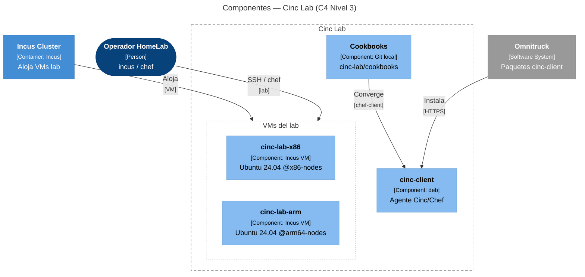

# C4 Nivel 3 — Componentes

Zoom dentro de cada **contenedor** del [Nivel 2](overview.md#nivel-2-contenedores):
componentes internos, tecnologías y relaciones. Para el mapa físico de nodos,
continúa en **[Nivel 4 — Despliegue](nivel-4-despliegue.md)**.

Volver a [Overview (Nivel 1–2)](overview.md).

## 3.1 — K3s Management

Desglose del clúster bare-metal de control: GitOps (Argo CD), identidad (Dex),
provisioning CAPI/CAPN, red de servicios (MetalLB, Ingress), operadores de
storage (OpenEBS, Longhorn), secretos (Sealed Secrets), upgrades (SUC) y
vCluster Platform opcional.

Detalle operativo: [Stack tecnológico](../implementacion/stack-tecnologico.md),
[GitOps](../gitops/index.md).

## 3.2 — Incus Cluster

Internals del clúster HA (alta disponibilidad) Incus en los 3 nodos físicos: quorum dqlite, daemon
por miembro, pool `local` (driver `dir`), cluster groups, scheduler manual en
`oliver`, UI (interfaz de usuario) nativa en invincible y OIDC (OpenID Connect) Dex (Fase 4).

Detalle: [Clúster Incus](../incus/cluster-setup.md).

## 3.3 — Workload Clusters

Estructura interna de un clúster **kubeadm** efímero provisionado por CAPN (Cluster API Provider for Incus)
(ej. `demo`): LXCMachine en Incus, control plane, workers y CNI (Container Network Interface) Flannel del
workload. No es K3s (distribución ligera de Kubernetes) anidado.

Detalle: [CAPN](../capn/index.md), [Fase 6](../implementacion/fase-6-capn.md).

## 3.4 — Storage

Componentes lógicos del tier híbrido **OpenEBS LocalPV** (default, 3 nodos) +
**Longhorn v1** (réplica cross-arch entre `invincible` y `deborah`). Los pods
corren en K3s; aquí se modelan como contenedor L2 (capa 2 del modelo OSI) separado por claridad.

Detalle: [Storage](../storage/index.md).

## 3.5 — Cinc Lab

Sandbox de aprendizaje **Cinc/Chef** en VMs (máquinas virtuales) Incus (Ubuntu 24.04), una en
`@x86-nodes` y otra en `@arm64-nodes`. No es pieza de producción del HomeLab.

Detalle: [Lab Cinc/Chef](../labs/cinc/index.md).

## Siguiente

**[→ Nivel 4 — Despliegue](nivel-4-despliegue.md)** — mapa físico de los 3 nodos.
