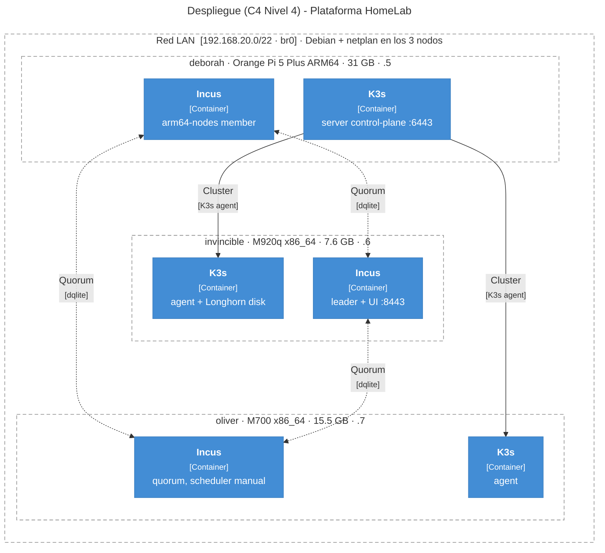

# C4 Nivel 4 — Despliegue

Mapa **físico** de la plataforma: los 3 nodos en la LAN (red local), SO Debian con
`br0`, daemon Incus y rol K3s (distribución ligera de Kubernetes) en cada uno. Complementa el zoom lógico del
[Nivel 3 — Componentes](nivel-3-componentes.md).

Volver a [Overview (Nivel 1–2)](overview.md).

## Nodos y roles

| Nodo | Hardware | RAM | IP `br0` | Incus | K3s |
|---|---|---|---|---|---|
| `invincible` | Lenovo M920q x86_64 | 7.6 GB | 192.168.20.6 | Leader + UI `:8443` | agent; disco Longhorn |
| `oliver` | Lenovo M700 x86_64 | 15.5 GB | 192.168.20.7 | Quorum; scheduler **manual** | agent |
| `deborah` | Orange Pi 5 Plus ARM64 | 31 GB | 192.168.20.5 | Miembro `arm64-nodes` | **server** (CP) `:6443` |

!!! note "Presupuesto RAM"
    `oliver` tiene scheduler manual porque no debe alojar instancias Incus de
    forma automática (preserva RAM para el management cluster). `deborah` es
    control-plane por RAM disponible (31 GB), aunque sea ARM64 (arquitectura ARM de 64 bits) — validar CNI (Container Network Interface)
    y cargas antes de producción intensiva.

Detalle hardware: [Inventario](../hardware/inventory.md).

## Diagrama de despliegue

## Anterior

**[← Nivel 3 — Componentes](nivel-3-componentes.md)**
