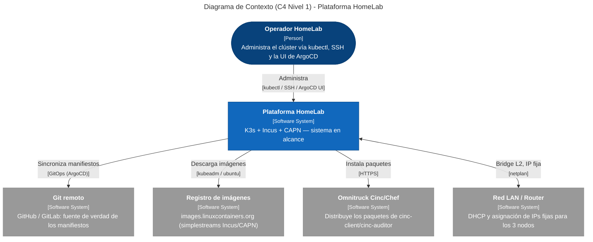
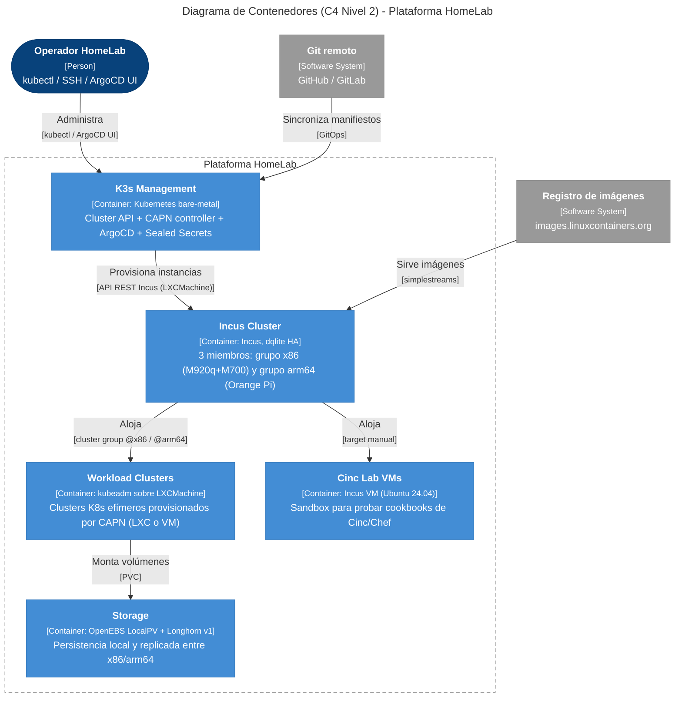

# Arquitectura

Vista de diseño del HomeLab. Para el **stack tecnológico** con diagrama por
capas y enlaces a documentación oficial de cada producto, ver
**[Stack tecnológico](../implementacion/stack-tecnologico.md)**.

Guía ejecutable: **[Implementación](../implementacion/index.md)**.

## Capas

1. **Hardware** — 3 nodos físicos (2x x86_64, 1x ARM64). Ver [inventario](../hardware/inventory.md).
2. **Incus Cluster** — sustrato de virtualización, 3 miembros con quorum dqlite.
   Cluster groups `x86-nodes` / `arm64-nodes` para dirigir dónde corre cada instancia.
3. **K3s (distribución ligera de Kubernetes) Management** — el clúster K3s bare-metal existente, que aloja:
    - Cluster API (Application Programming Interface) core + controller de CAPN (Cluster API Provider for Incus)
    - ArgoCD (GitOps)
    - Sealed Secrets controller
4. **Workload Clusters** — clusters kubeadm efímeros provisionados por CAPN
   como instancias Incus (LXC o VM), para dev/test/aislamiento.
5. **Storage** — OpenEBS LocalPV (default, en los 3 nodos) + Longhorn v1
   (replicado entre `invincible` y `deborah`, excluyendo `oliver` por RAM).

## Decisión de diseño clave

No se migra el K3s de producción a nested-K8s. El K3s existente se mantiene
como *management cluster* de Cluster API; CAPN provisiona clusters adicionales
bajo demanda sobre el mismo hardware, sin tocar producción.

## Diagramas C4

### Nivel 1 — Contexto

Vista de más alto nivel: la **Plataforma HomeLab** como una sola caja negra y
los actores/sistemas externos con los que interactúa (operador, Git, registro
de imágenes, Omnitruck y la LAN). Útil para entender *qué entra y sale* del
sistema sin detalle interno.

### Nivel 2 — Contenedores

Abre la caja de la plataforma y muestra los **contenedores lógicos** (K3s
Management, Incus Cluster, Workload Clusters, Storage y Cinc Lab) con sus
tecnologías y cómo se relacionan entre sí y con los sistemas externos.

## Profundizar en C4

| Nivel | Página | Qué muestra |
|---|---|---|
| 1–2 | *(esta página)* | Contexto + contenedores lógicos |
| 3 | **[Componentes](nivel-3-componentes.md)** | Zoom por contenedor (K3s, Incus, workload, storage, Cinc) |
| 4 | **[Despliegue](nivel-4-despliegue.md)** | 3 nodos físicos en la LAN |

