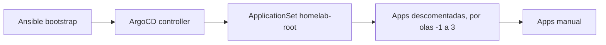

# GitOps — catálogo y troubleshooting

!!! info "Parte de la guía de implementación"
    El recorrido paso a paso está en **[Fase 4 — GitOps](../implementacion/fase-4-gitops.md)**.
    Ansible bootstrap (K3s, red): [Fases 0–3](../implementacion/index.md).

Referencia de **Applications** Argo CD y resolución de problemas. Manifiestos en
[`gitops/`](https://github.com/symintel/gitops).

Documentación relacionada:

- [Opciones del playbook K3s](../k3s/playbook-options.md) — flags Ansible (kube-vip, ArgoCD controller, …)
- [vCluster Platform](../vcluster/index.md) — SSO (inicio de sesión único) Dex + kubeconfig web (K3s host + vclusters)
- [Clúster Incus](../incus/cluster-setup.md#ui-de-administracion) — UI (interfaz de usuario) web + OIDC (OpenID Connect) Dex
- [Storage](../storage/index.md) / [Secretos](../secrets/index.md)
- [Stack tecnológico](../implementacion/stack-tecnologico.md)

## Dos repos, dos responsabilidades

| Repo | Qué instala | Herramienta |
|---|---|---|
| [`homelab`](https://github.com/symintel/homelab) | K3s binario, kube-vip CP, controller ArgoCD, red SO | [Ansible](https://docs.ansible.com/) |
| [`gitops`](https://github.com/symintel/gitops) | MetalLB, Gateway API, storage, vCluster, CAPN, … | [Argo CD](https://argo-cd.readthedocs.io/) |

---

## Catálogo de componentes GitOps

Cada fila es una **Application** de ArgoCD (salvo manifiestos auxiliares).
Sync **auto** = la sincroniza `homelab-root` (si está descomentada en `root-appset.yaml`); **manual** = queda comentada hasta que la actives.

### Bootstrap

| Manifiesto | Sync | Para qué sirve |
|---|---|---|
| [`bootstrap/root-appset.yaml`](https://github.com/symintel/gitops/blob/main/bootstrap/root-appset.yaml) | Una vez, a mano | **ApplicationSet**: genera la Application raíz `homelab-root` con las apps descomentadas de su lista, desplegadas por olas. Es el único `kubectl apply` GitOps tras tener el controller; ArgoCD no lo gestiona, así que se vuelve a aplicar con `kubectl apply -f` cada vez que cambia la lista. |

### Wave 0 — Fundamentos (storage + LB controller)

| Application | Producto | Para qué sirve |
|---|---|---|
| **`sealed-secrets`** | [Sealed Secrets](https://github.com/bitnami-labs/sealed-secrets) | Controller que descifra `SealedSecret` en el clúster. |
| **`openebs`** | [OpenEBS](https://openebs.io/docs) | Storage local por nodo (LocalPV). |
| **`homelab-storage`** | — | StorageClasses `openebs-hostpath` (default) y `longhorn-mixto` ([trade-offs](../storage/index.md#storageclasses-del-cluster)). |
| **`metallb`** | [MetalLB](https://metallb.universe.tf/) | Controller LoadBalancer en LAN. **No** es kube-vip. |
| **`gateway-api`** | [Gateway API](https://gateway-api.sigs.k8s.io/) | CRDs `Gateway`, `HTTPRoute`, etc. (canal standard). |
| **`cert-manager`** | [cert-manager](https://cert-manager.io/docs/) | Emisión de certificados TLS. |

### Wave 1 — Red de servicios + storage HA

| Application | Producto | Para qué sirve |
|---|---|---|
| **`metallb-config`** | [MetalLB](https://metallb.universe.tf/) | Pool L2 `192.168.23.200–192.168.23.220` (reservado fuera del DHCP del router). |
| **`cert-manager-config`** | [cert-manager](https://cert-manager.io/docs/) | CA propia del HomeLab (`ClusterIssuer homelab-ca`). |
| **`kong`** (o `traefik`, `nginx-gateway`) | [Kong Ingress Controller](https://developer.konghq.com/kubernetes-ingress-controller/) | Controlador de [Gateway API](https://gateway-api.sigs.k8s.io/) y `Gateway homelab` (HTTP/HTTPS, `*.homelab.local`). Se activa solo uno; ver [Cambiar el controlador de Gateway](../operacion/cambiar-gateway.md). |
| **`longhorn`** | [Longhorn](https://longhorn.io/docs/) | Storage replicado cross-arch. |

### Wave 2 — ArgoCD accesible + Dex

| Application / carpeta | Producto | Para qué sirve |
|---|---|---|
| **`argocd-route`** | [Gateway API](https://gateway-api.sigs.k8s.io/) | `HTTPRoute`: UI en `https://argocd.homelab.local`. |
| **`argocd/config/`** (`argocd`) | [Dex](https://dexidp.io/docs/) | Connector GitHub + staticClients vCluster e Incus UI. |
| [`argocd/secrets/`](https://github.com/symintel/gitops/tree/main/argocd/secrets) | [1Password SDK](https://github.com/1Password/onepassword-sdk-python) | OAuth desde app local |

### Wave 3 — Operaciones

| Application | Producto | Para qué sirve |
|---|---|---|
| **`k3s-upgrade`** | [system-upgrade-controller](https://github.com/rancher/system-upgrade-controller) | Upgrades K3s escalonados. |

### Sync manual (tú decides cuándo)

| Application | Producto | Para qué sirve |
|---|---|---|
| **`vcluster-platform`** | [vCluster Platform](https://www.vcluster.com/docs/platform/) | UI: kubeconfig del host K3s (connected) + vclusters. |
| **`capn-demo`** | [CAPN](https://capn.linuxcontainers.org/) | Cluster API sobre Incus. |
| **`calico-operator`** + **`calico-config`** | [Calico](https://docs.tigera.io/calico/latest/about/) | CNI Calico (CRDs + operador + `Installation`). **Activas**: ArgoCD administra y actualiza Calico (v3.33.0); lo instaló Ansible al crear el clúster. Sync **manual**. Ver [Calico con ArgoCD](../operacion/actualizar-calico.md). |
| **`canal`** | [Canal](https://docs.tigera.io/calico/latest/getting-started/kubernetes/flannel/flannel) | CNI Canal (Flannel + políticas Calico). |
| **`cilium`** | [Cilium](https://docs.cilium.io/) | CNI Cilium vía Helm. |

!!! note "CNI: Fase 3, no Fase 4"
    El CNI (Container Network Interface) se elige en [Fase 3 — K3s](../implementacion/fase-3-k3s.md) (`k3s_install.core.cni`).
    Por defecto **Flannel** embebido (Ansible, sin Application). Las apps anteriores
    son alternativa GitOps si K3s (distribución ligera de Kubernetes) ya tiene `--flannel-backend=none`. Ver
    [playbook-options — CNI](../k3s/playbook-options.md#cni).

### Manifiestos de soporte (no son Applications)

| Ruta | Para qué sirve |
|---|---|
| [`storage/`](https://github.com/symintel/gitops/tree/main/storage) | StorageClasses vía `homelab-storage`. |
| [`metallb/`](https://github.com/symintel/gitops/tree/main/metallb) | Pool + L2Advertisement. |
| [`k3s-upgrade/`](https://github.com/symintel/gitops/tree/main/k3s-upgrade) | CRs `Plan` SUC. |
| [`vcluster/values/platform.yaml`](https://github.com/symintel/gitops/blob/main/vcluster/values/platform.yaml) | Helm values Platform + OIDC Dex. |
| [`capn/clusters/`](https://github.com/symintel/gitops/tree/main/capn/clusters) | Clusters generados con `clusterctl`. |
| [`cni/calico/`](https://github.com/symintel/gitops/tree/main/cni/calico) | Installation CR Calico (`calico-config` Application). |

---

## kube-vip (Ansible) vs MetalLB (GitOps)

| | [kube-vip](https://kube-vip.io/) | [MetalLB](https://metallb.universe.tf/) |
|---|---|---|
| **Quién lo instala** | Ansible (`k3s_kube_vip`) | ArgoCD |
| **Qué VIPea** | Solo API server `:6443` | Services `LoadBalancer` |
| **Config clave** | `svc_enable=false` | Pool `192.168.23.200–.220` |

---

## Resolución de problemas rápida

| Síntoma | Revisar |
|---|---|
| Application `Degraded` | `kubectl describe application -n argocd <nombre>` |
| `arc-runners` `OutOfSync` y el pod del listener se reinicia cada pocos minutos | ArgoCD poda en bucle los recursos que crea el controlador de ARC (`AutoscalingListener`, `Role`, `RoleBinding`: copian la etiqueta `app.kubernetes.io/instance`). Se corrige con `application.resourceTrackingMethod: annotation` en `argocd-cm` (ya está en `gitops/argocd/config`). Comprueba: `kubectl -n argocd get cm argocd-cm -o jsonpath='{.data.application\.resourceTrackingMethod}'` → `annotation`; si no, sincroniza `argocd` y reinicia el controlador: `kubectl -n argocd rollout restart statefulset argocd-application-controller` |
| Gateway sin dirección | `metallb-config` sync, pool libre en LAN |
| SSO vCluster falla | `playbook-dex-oauth-secrets.yml --tags ensure,argocd,vcluster`; restart Dex |
| Incus UI SSO falla | `incus config get oidc.issuer` / `oidc.client.id` en invincible; `invincible` debe confiar en la CA del HomeLab (`--tags incus_ca`); cliente `incus-ui` público en `dex.config`; restart Dex |
| Dex login sin GitHub | Secretos GitHub en `argocd-secret`; Redirect URIs de la OAuth App correcto |
| GitHub login rechazado | Usuario debe pertenecer al team `devops` de la org `symintel` |
| Longhorn pod pending | Etiquetas `node.longhorn.io/create-default-disk` ([playbook labels](../k3s/playbook-options.md)) |
| Pods CNI no Ready | K3s con `--flannel-backend=none` antes de sync; solo **una** app CNI activa ([CNI](../k3s/playbook-options.md#cni)) |

Manifiestos fuente: [`gitops/argocd/apps/`](https://github.com/symintel/gitops/tree/main/argocd/apps).

Guía ejecutable: **[Fase 4 — GitOps](../implementacion/fase-4-gitops.md)**.
