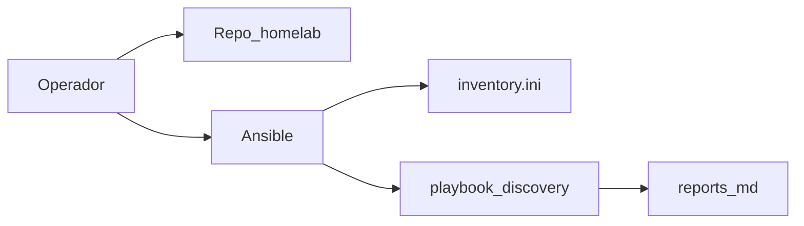

# Fase 0 — Preparación

## Objetivo

Tener el repo clonado, Ansible operativo, inventario validado y (opcional)
un informe de hardware medido antes de tocar red o clústeres.

## Qué aprendes

Cómo Ansible usa un **inventario** como fuente de verdad de hosts, y por qué
un **discovery** opcional evita suposiciones sobre RAM, disco y arquitectura
al elegir roles (control-plane, Longhorn, etc.).

!!! abstract "Aprende esta fase"
    **En simple:** Ansible es como una lista de tareas que entregas a varios ayudantes: todos la
    ejecutan igual, sin que tengas que ir uno por uno. El **inventario** es la agenda con el nombre,
    la dirección y el rol de cada ayudante (cada nodo).

    **Conceptos clave**

    - **Inventario:** el archivo que dice qué equipos existen y cómo conectarse a ellos.
    - **Playbook:** la receta de tareas que Ansible aplica a esos equipos.
    - **Idempotencia:** repetir un playbook deja el mismo resultado; no rompe lo que ya estaba bien.
    - **Modo simulación (`-C`):** muestra qué cambiaría sin tocar nada.
    - **SSH (Secure Shell):** el canal cifrado con el que Ansible entra a cada nodo.

    **Reto práctico (seguro, solo lectura):** comprueba que Ansible llega a los tres nodos y ve qué cambiaría
    un playbook sin aplicarlo.

    ```bash
    ansible -i ansible/inventory.ini incus_cluster -m ping
    ansible-playbook -i ansible/inventory.ini ansible/playbook-discovery.yml -C
    ```

    ??? question "¿Para qué sirve un inventario?"
        Para que Ansible sepa qué equipos administrar, cómo llegar a ellos y a qué grupo pertenece cada uno.
        Es la fuente de verdad de los nodos.

    ??? question "¿Por qué se puede repetir un playbook idempotente sin miedo?"
        Porque cada tarea revisa primero el estado actual y solo cambia lo que falta. Si todo ya está bien,
        no hace nada.

    ??? question "¿Qué diferencia hay entre ejecutar un playbook y ejecutarlo con `-C`?"
        Con `-C` Ansible simula: informa qué cambiaría pero no modifica los equipos.

    ¿Dudas? Usa el botón **Aprende con IA** junto a cada título, o la página [Aprende](../aprende.md).

## Stack de esta fase



- **[Ansible](https://docs.ansible.com/)** — Orquestador de bootstrap; Fase 0–3.
- **[Debian](https://www.debian.org/)** — SO en invincible, oliver y deborah.

Profundización: [Discovery de hardware](../hardware/discovery.md) · [Inventario](../hardware/inventory.md)

## Antes de empezar

- [x] Tres nodos accesibles por SSH (aunque aún con DHCP está bien).
- [x] Python 3.11+ en tu estación.
- [x] Clave SSH (Secure Shell) configurada hacia los nodos.
- [x] **GitHub:** la organización **`symintel`** creada, con un team
      **`devops`** (sus miembros son quienes pueden entrar a ArgoCD) y una
      cuenta que sea **owner** de la organización para crear las Apps.
      Detalle en [Plataforma symintel — GitHub](../symintel/github.md).
- [x] **1Password:** la app de escritorio instalada, con una bóveda llamada
      **`HomeLab`** y *Settings → Developer → Integrate with other apps*
      activado. Ahí se guardan las credenciales que usan los playbooks
      ([qué items y campos](../symintel/github.md#items-en-1password)).

## Ejecutar

### Clonar repo y entorno Ansible

```bash
git clone https://github.com/symintel/homelab.git
cd homelab
python3 -m venv .venv
source .venv/bin/activate
pip install -r requirements.txt   # Ansible, mkdocs, ansible-lint, etc.
ansible-galaxy collection install -r ansible/requirements.yml
```

!!! warning "Ruta del requirements.txt"
    `requirements.txt` vive en la **raíz del repo**, no en `ansible/` — es un
    error común confundirlo con `ansible/requirements.yml` (ese es el
    manifiesto de *collections* de Galaxy, un archivo YAML distinto, no algo
    que `pip install -r` pueda instalar).

### Día 0 — nodos recién instalados (solo la primera vez por nodo)

Un nodo recién flasheado (Debian netinst) todavía no tiene `python3` ni
`sudo` listos, y el usuario admin no está en el grupo `sudo` — el `ping`
de más abajo (usa el módulo `ansible.builtin.ping`, que sí necesita Python
en el destino) va a fallar sin este paso primero:

```bash
cd ansible
ansible-playbook -i bootstrap/inventory.ini bootstrap/setup_sudo.yml --ask-pass
cd ..
```

**Qué usuario recibe `sudo`.** El playbook da `sudo` sin contraseña al usuario administrador que creaste al
instalar Debian. Por defecto es el **mismo nombre que usas en tu estación**, porque Ansible se conecta después con
ese nombre. Si en el nodo se llama distinto, indícalo y dile a Ansible cómo conectarse:

```bash
ansible-playbook -i bootstrap/inventory.ini bootstrap/setup_sudo.yml --ask-pass -e bootstrap_admin_user=<usuario>
```

y agrega `ansible_user=<usuario>` a los nodos en `inventory.ini`. El usuario tiene que existir ya en el nodo (el
playbook se detiene si no) y solo admite minúsculas, dígitos, `_` y `-`.

Detalle completo (por qué conecta como `root` y dónde encaja en el resto
del bootstrap) en
[`ansible/bootstrap/README.md`](https://github.com/symintel/homelab/blob/main/ansible/bootstrap/README.md).
Si tus 3 nodos ya tienen un usuario admin con sudo funcionando, salteá
este paso.

### Validar inventario

Revisa [`ansible/inventory.ini`][inventory-ini]: `ansible_host`, `static_ip`,
`bridge_iface` por nodo.

[inventory-ini]: https://github.com/symintel/homelab/blob/main/ansible/inventory.ini

```bash
ansible -i ansible/inventory.ini incus_cluster -m ping
```

### Discovery opcional (recomendado la primera vez)

=== "Recomendado (Ansible)"

    ```bash
    cd ansible
    ansible-playbook -i inventory.ini playbook-discovery.yml
    ```

    Salida en `ansible/reports/` (gitignored): ficha por nodo + `summary.md`.

=== "Alternativa manual"

    Recopila CPU, RAM, disco y red con `lscpu`, `free -h`, `lsblk`, `ip -br link`
    y compara con [Inventario de hardware](../hardware/inventory.md).

### GitHub y 1Password — org symintel (manual, una sola vez)

Aquí se preparan, una sola vez, las cuentas y credenciales de GitHub que el
HomeLab necesita: las Apps con las que el clúster habla con GitHub (entre
ellas la que usa ArgoCD para leer el repo privado `symintel/gitops`) y los
repos base (`gitops`, `core-pipelines` e `infra`). Todo se crea a mano, y las credenciales se
guardan en 1Password para que después los playbooks las lean desde ahí. El
detalle de cada una (permisos, dónde encontrar cada dato en GitHub y cómo
cargarlo en 1Password) está en
[Plataforma symintel — GitHub](../symintel/github.md).

Los items de 1Password van en la bóveda **`HomeLab`**, casi todos como
**Nota segura** con campos propios. El título del item y el nombre de cada
campo tienen que ser **exactos**, porque el playbook los busca por nombre:
[cómo crear el item](../symintel/github.md#como-crear-un-item-con-campos-propios).

Con una cuenta **owner de la organización** `symintel`:

1. **GitHub App `symintel-terraform`** → item `symintel-terraform` (Nota
   segura) con los campos `app_id` (Texto), `installation_id` (Texto) y
   `private_key` (Contraseña, el `.pem` completo).
   [Permisos y dónde está cada dato](../symintel/github.md#symintel-terraform).
2. **GitHub App `symintel-arc-runners`** → item `symintel-arc-runners`, con
   los mismos tres campos pero con los datos de esta App.
   [Permisos y pasos](../symintel/github.md#symintel-arc-runners).
3. **OAuth App `Symintel Dex`** → campos `GITHUB_CLIENT_ID` (Texto) y
   `GITHUB_CLIENT_SECRET` (Contraseña) en el item `symintel-dex` (Nota segura).
   [Pasos](../symintel/github.md#oauth-app-symintel-dex).
4. **Repos privados**, con su contenido subido con git:
    - `gitops`.
    - `core-pipelines`: en *Settings → Actions → General → Access*, elige
      "Accessible from repositories in the 'symintel' organization". No hace
      falta crear tags: mientras pruebas, los demás repos lo usan con `@main`.
    - `infra`.
5. **GitHub App `symintel-argocd`** (solo lectura, instalada **solo en
   `gitops`**) → item `symintel-argocd` con los mismos tres campos. Va
   después de los repos porque se instala en `gitops`.
   [Permisos y pasos](../symintel/github.md#paso-2-repos-app-de-argocd-y-ftp-manual).
6. **Llave de Sealed Secrets** *(opcional hasta la Fase 6)*: un par de llaves
   generado con `openssl`, en el item `sealed-secrets` (`certificate` y
   `private_key`), para que sobreviva si reinstalas K3s.
   [Comando y pasos](../symintel/github.md#paso-2-repos-app-de-argocd-y-ftp-manual).
7. **Credenciales FTP (File Transfer Protocol) del repo `api`**: `api` es el
   primer proyecto del mapa de repos y despliega por FTP, así que necesita su
   item `ftp-api` (Nota segura) desde el primer pipeline. Cada repo que
   agregues después sigue el
   [procedimiento de rutina — Agregar un repo](../operacion/agregar-repo.md). El item lleva 8 campos: `dev_host`, `dev_user`,
   `dev_password`, `dev_remote_dir` y los mismos cuatro con `prod_`. Los
   `*_password` van como Contraseña y el resto como Texto.
   [Tabla con ejemplos](../symintel/github.md#paso-2-repos-app-de-argocd-y-ftp-manual).

Comprueba que todas las credenciales se pueden leer de 1Password. Son dos
comandos, y ninguno toca un clúster ni muestra valores secretos:

- **`--check`**: revisa cada item esperado y marca con ✓ los campos que están
  bien y con ✗ los que faltan, tienen otro nombre o están dentro de una
  sección. Córrelo primero: si algo está mal, dice exactamente qué.
- **`--dry-run`**: lee todos los valores y lista los Secrets que se van a
  crear en el clúster, con los valores ocultos (`<redacted>`). Confirma que
  las llaves se pueden interpretar.

El script lee 1Password a través de la app de escritorio, así que la app
tiene que estar **desbloqueada** y con *Settings → Developer → Integrate with
other apps* activado. Además hay que decirle **qué cuenta** usar con la
variable **`ONEPASSWORD_ACCOUNT_NAME`**: es el nombre de tu cuenta tal como
aparece arriba a la izquierda en la barra lateral de la app (por ejemplo
`Mi Cuenta`). Si no la defines, usa `Personal`.

```bash
export ONEPASSWORD_ACCOUNT_NAME="Mi Cuenta"  # tu cuenta
.venv/bin/python ansible/scripts/apply_platform_secrets.py --check
.venv/bin/python ansible/scripts/apply_platform_secrets.py --dry-run
```

`--check` termina bien cuando todos los items tienen ✓ (el aviso de que no
hay items `ftp-<repo>` es solo informativo si ningún repo despliega).

## Opciones

| Opción | Cuándo |
|---|---|
| Saltar discovery | Re-despliegue y hardware ya conocido |
| Actualizar inventario | Tras cambiar IPs en Fase 1 |

<div class="card">
  <div class="card-kicker">Análisis de trade-offs</div>
  <div class="option-grid">
    <div class="card-col">
      <div class="card-title">Discovery Ansible</div>
      <div class="text-muted">RAM/disco/I/O medidos → <code>reports/</code></div>
      <div class="text-muted">Requiere SSH y unos minutos por nodo</div>
    </div>
    <div class="card-col">
      <div class="card-title">Discovery manual</div>
      <div class="text-muted">Sin playbook</div>
      <div class="text-muted">Valores desactualizados; errores de planificación</div>
    </div>
    <div class="card-col">
      <div class="card-title">Saltar discovery</div>
      <div class="text-muted">Más rápido en re-despliegues</div>
      <div class="text-muted">Presupuesto RAM/disco puede no coincidir con la realidad</div>
    </div>
  </div>
</div>

## Verificar

```bash
ansible -i ansible/inventory.ini incus_cluster -m ping
# todos → SUCCESS

export ONEPASSWORD_ACCOUNT_NAME="Mi Cuenta"  # tu cuenta
.venv/bin/python ansible/scripts/apply_platform_secrets.py --check
# todos los items con ✓
.venv/bin/python ansible/scripts/apply_platform_secrets.py --dry-run
# lista los Secrets de plataforma (valores <redacted>), sin errores de 1Password
```

## Si falla

| Síntoma | Revisar |
|---|---|
| `UNREACHABLE` | `ansible_host`, firewall, clave SSH |
| `ping` falla por Python ausente | Nodo recién instalado — correr `setup_sudo.yml` (paso "Día 0" arriba) |
| Discovery sin reports | Ejecutar desde `ansible/`; permisos de escritura |
| `--check` o `--dry-run` no leen 1Password | App desbloqueada con *Integrate with other apps* y `ONEPASSWORD_ACCOUNT_NAME` con el nombre de tu cuenta. Si dice *field cannot be found* o *Bóveda no encontrada*, mira la salida de `--check`: marca qué item o campo no coincide ([nombres esperados](../symintel/github.md#items-en-1password)) |

## Siguiente

**[→ Fase 1 — Red](fase-1-red.md)**
