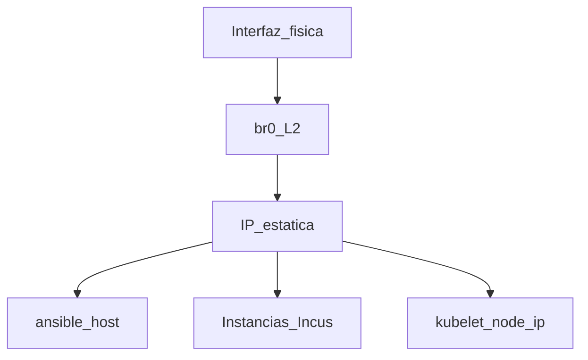

# Fase 1 — Red

## Objetivo

Bridge `br0` con **IP estática** en los 3 nodos, lista para Incus, K3s (distribución ligera de Kubernetes) y CAPN (Cluster API Provider for Incus).

## Qué aprendes

Por qué el HomeLab exige IP fija: Incus graba `cluster.https_address`, K3s usa
la IP como identidad del kubelet y CAPN referencia `https://<IP>:8443` en
secretos.

!!! abstract "Aprende esta fase"
    **En simple:** una IP fija es tu dirección postal: si cambia cada día, nadie te encuentra. Un
    **bridge** es como un enchufe múltiple virtual: deja que el equipo y las máquinas virtuales
    compartan la misma conexión a la red.

    **Conceptos clave**

    - **IP estática o dinámica:** una IP estática se queda igual; una dinámica la reparte el router (DHCP, Dynamic Host Configuration Protocol) y puede cambiar.
    - **Máscara y CIDR (Classless Inter-Domain Routing):** la notación `/22` indica cuántas direcciones comparten la red.
    - **Gateway (puerta de enlace):** el equipo, normalmente el router, por donde se sale a otras redes.
    - **DNS (Domain Name System):** la "guía telefónica" que traduce nombres a IP.
    - **Bridge `br0`:** la interfaz virtual que comparten el nodo, Incus y K3s.

    **Reto práctico (solo lectura):** en un nodo, encuentra su IP, su máscara y su gateway.

    ```bash
    ip -br addr show br0
    ip route | grep default
    ```

    ??? question "¿Por qué el HomeLab necesita IP fija en los nodos?"
        Porque Incus guarda la dirección del clúster, K3s usa la IP como identidad del nodo y otros
        componentes la referencian: si cambiara, el clúster dejaría de encontrarse.

    ??? question "¿Qué es un bridge y para qué sirve aquí?"
        Es una interfaz virtual que conecta varias interfaces en una sola red. Permite que las
        instancias de Incus y los pods usen la red física del nodo.

    ??? question "En `192.168.20.5/22`, ¿qué parte es la dirección y cuál la máscara?"
        `192.168.20.5` es la dirección y `/22` indica que los primeros 22 bits son la red.

    ¿Dudas? Usa el botón **Aprende con IA** junto a cada título, o la página [Aprende](../aprende.md).

## Stack de esta fase



- **[Netplan](https://netplan.io/)** — Configuración declarativa de red en Debian; Fase 1.
- **[Ansible](https://docs.ansible.com/)** — Aplica netplan de forma idempotente vía `playbook-set-static-ip.yml`.
- Rol: [`netplan_bridge`](https://github.com/symintel/homelab/blob/main/ansible/roles/netplan_bridge/README.md)

Profundización: [Red — ejemplos netplan](../networking/index.md)

## Antes de empezar

- [ ] [Fase 0 — Preparación](fase-0-preparacion.md) completada (`ansible ping` OK).
- [ ] Sabes la interfaz física por nodo (`eno1`, `eno2`, `enP4p65s0`).
- [ ] IPs destino definidas en inventario.

| Nodo | Interfaz | IP en br0 |
|---|---|---|
| invincible | `eno2` | 192.168.20.6 |
| oliver | `eno1` | 192.168.20.7 |
| deborah | `enP4p65s0` | 192.168.20.5 |

> Confirmá siempre con `ip -br link` en el nodo antes de asumir estos
> valores.

## Ejecutar

!!! warning "Corte de SSH"
    Si cambias de IP, Ansible puede perder la sesión. El playbook usa
    `serial: 1` — un nodo a la vez. Actualiza `ansible_host` tras cada nodo
    si la IP de conexión cambió.

=== "Recomendado (Ansible)"

    ```bash
    cd ansible
    # Un nodo a la vez si la IP de conexión cambia
    ansible-playbook -i inventory.ini playbook-set-static-ip.yml \
      --limit invincible
    # Actualiza ansible_host en inventory.ini si hace falta, luego:
    ansible-playbook -i inventory.ini playbook-set-static-ip.yml \
      --limit oliver
    ansible-playbook -i inventory.ini playbook-set-static-ip.yml \
      --limit deborah
    ```

=== "Alternativa manual"

    Ver ejemplos YAML en [Red](../networking/index.md):

    ```bash
    sudo apt install -y netplan.io
    sudo netplan apply
    ```

## Opciones

| Decisión | Default HomeLab |
|---|---|
| Orden de nodos | Uno a la vez (`serial: 1`) |

!!! note "Los 3 nodos cambian de IP al aplicar"
    No hay atajo: actualizá `ansible_host` en `inventory.ini` después de
    cada nodo (por eso `serial: 1`).

<div class="card">
  <div class="card-kicker">Análisis de trade-offs</div>
  <div class="option-grid">
    <div class="card-col">
      <div class="card-title">Ansible (<code>playbook-set-static-ip.yml</code>)</div>
      <div class="text-muted">Idempotente; template Netplan por host</div>
      <div class="text-muted">Puede cortar SSH si cambia la IP</div>
    </div>
    <div class="card-col">
      <div class="card-title">Netplan manual</div>
      <div class="text-muted">Control total del YAML</div>
      <div class="text-muted">Sin rollback automático; fácil desalinear los 3 nodos</div>
    </div>
    <div class="card-col">
      <div class="card-title"><code>serial: 1</code></div>
      <div class="text-muted">Recuperación nodo a nodo</div>
      <div class="text-muted">Más lento que los 3 en paralelo</div>
    </div>
  </div>
</div>

## Verificar

```bash
ansible -i ansible/inventory.ini incus_cluster -m command -a "ip -br addr show br0"
# Cada nodo muestra su IP estática en br0
ping -c 2 192.168.20.5
ping -c 2 192.168.20.6
ping -c 2 192.168.20.7
```

## Si falla

| Síntoma | Revisar |
|---|---|
| SSH perdido tras apply | Conectar por IP nueva; actualizar `inventory.ini` |
| Sin `br0` | Interfaz en `bridge_iface`; logs `journalctl -u systemd-networkd` |

## DNS (BIND en deborah)

Los 3 nodos usan `192.168.20.5` (deborah) como primer DNS y el gateway
`192.168.20.1` como segundo. Con la IP fija ya aplicada en deborah, instalá
y configurá BIND (Berkeley Internet Name Domain) ahí (corre solo sobre deborah):

```bash
ansible-playbook -i inventory.ini playbook-bind-dns.yml
```

Hasta que corra, los nodos resuelven por el gateway, con algo de demora en
cada consulta. Detalle:
[`ansible/roles/bind_dns/README.md`](https://github.com/symintel/homelab/blob/main/ansible/roles/bind_dns/README.md).

## Hardening (recomendado antes de seguir)

Con la IP ya fija es el momento de endurecer el host, antes de que se una
al cluster. No es parte de las Fases 0–6 originales, pero va **acá** en la
secuencia real (ver
[Hardening post-incidente](../security/hardening-post-incidente.md)):

```bash
ansible-playbook -i inventory.ini playbook-hardening.yml --check --diff
ansible-playbook -i inventory.ini playbook-hardening.yml
```

Detalle:
[`ansible/roles/host_hardening/README.md`](https://github.com/symintel/homelab/blob/main/ansible/roles/host_hardening/README.md).

## Siguiente

**[→ Fase 2 — Incus](fase-2-incus.md)**

Orden completo de bootstrap (incluye hardening, BIND, WiFi):
[`ansible/bootstrap/README.md`](https://github.com/symintel/homelab/blob/main/ansible/bootstrap/README.md).
