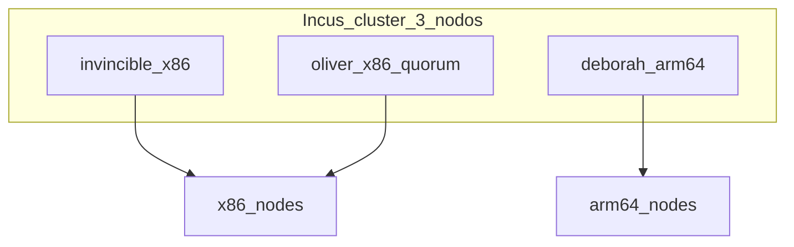

# Fase 2 — Incus

## Objetivo

Clúster **Incus** de 3 nodos con quorum, cluster groups por arquitectura y
`oliver` en scheduler manual.

## Qué aprendes

Incus como **hipervisor compartido**: quorum dqlite en 3 miembros, cluster
groups para dirigir cargas x86 vs ARM64 (arquitectura ARM de 64 bits), y scheduler manual para proteger RAM.

!!! abstract "Aprende esta fase"
    **En simple:** Incus es un edificio de departamentos. Cada departamento es una **instancia**:
    un contenedor (un cuarto ligero que comparte las instalaciones del edificio) o una máquina virtual
    (un departamento completo, con su propia cocina). Con tres edificios coordinados, si uno cierra los otros dos siguen funcionando.

    **Conceptos clave**

    - **Contenedor y máquina virtual:** el contenedor es más ligero; la VM (Virtual Machine) aísla más.
    - **Clúster y quórum:** con 3 miembros, el clúster decide por mayoría y tolera la caída de uno.
    - **Cluster group:** una etiqueta para dirigir cargas a un tipo de nodo (por ejemplo, solo ARM64).
    - **x86_64 y ARM64:** dos arquitecturas de procesador distintas; no se mezclan en una misma instancia.
    - **Scheduler manual:** el nodo `oliver` no recibe instancias solo; protege su memoria.

    **Reto práctico (solo lectura):** mira los miembros del clúster y sus instancias.

    ```bash
    incus cluster list
    incus list -c ns4
    ```

    ??? question "¿Por qué un clúster de tres miembros y no de dos?"
        Con dos, si uno cae no hay mayoría y el clúster se bloquea. Con tres, la mayoría son dos y
        puede seguir funcionando.

    ??? question "¿Cuándo prefieres un contenedor y cuándo una VM?"
        Contenedor para cargas Linux ligeras y rápidas; VM cuando necesitas otro kernel o más aislamiento.

    ??? question "¿Para qué sirven los cluster groups?"
        Para decidir en qué nodos corre una instancia, por ejemplo mantener las cargas ARM64 en `deborah`.

    ¿Dudas? Usa el botón **Aprende con IA** junto a cada título, o la página [Aprende](../aprende.md).

## Stack de esta fase



- **[Incus](https://linuxcontainers.org/incus/docs/main/)** — Virtualización LXC/VM; Fase 2.
- **[Zabbly Incus stable](https://github.com/zabbly/incus-stable)** — Paquetes Debian; Fase 2.
- **[Ansible](https://docs.ansible.com/)** — Instala paquete, bootstrap, join, groups, UI (interfaz de usuario).
- Roles: [`incus_install`](https://github.com/symintel/homelab/blob/main/ansible/roles/incus_install/README.md),
  [`incus_cluster`](https://github.com/symintel/homelab/blob/main/ansible/roles/incus_cluster/README.md),
  [`incus_ui`](https://github.com/symintel/homelab/blob/main/ansible/roles/incus_ui/README.md)

Profundización: [Clúster Incus](../incus/cluster-setup.md)

## Antes de empezar

- [ ] [Fase 1 — Red](fase-1-red.md) completada (IPs fijas en `br0`).
- [ ] `br0` operativo en los 3 nodos.
- [ ] ≥ **20 GB libres** en cada nodo (ver requisitos de almacenamiento).

## Requisitos de almacenamiento

Default HomeLab: driver **`dir`** (directorio en el filesystem del SO, sin disco
dedicado). Variables en [`group_vars/incus_cluster/vars.yml`](https://github.com/symintel/homelab/blob/main/ansible/group_vars/incus_cluster/vars.yml).

| Aspecto | Valor / requisito |
|---|---|
| Driver | `dir` — sin partición ni loop dedicado |
| Pool por nodo | `local` (cada miembro tiene su pool local) |
| Ruta del pool | `/var/lib/incus/storage-pools/local` |
| Filesystem | ext4 o xfs; **no** NFS/CIFS como backend |
| Espacio libre mínimo | **20 GB** por nodo; **50 GB+** si crearás VMs o muchas instancias |
| Metadatos | dqlite y config del daemon comparten disco con el pool |

### Por nodo

| Nodo | Disco | Implicación |
|---|---|---|
| `invincible` | Kingston 224 GB SSD | Leader + UI; el pool más grande de los nodos x86 |
| `oliver` | TECLAST 120 GB SSD | Quorum; pool local obligatorio aunque no reciba instancias; evitar llenar el disco con imágenes CAPN |
| `deborah` | eMMC 233 GB (NVMe 250 GB no detectado hoy) | Si eMMC justo: `incus_storage_path: /srv/incus/storage-pools/local` en host_vars |

### Limitaciones de `dir`

- Sin copy-on-write a nivel de pool (snapshots de instancia y export tarball sí).
- VMs (máquinas virtuales) más lentas que con `zfs`/`btrfs`/`lvm`.
- Sin thin provisioning ni compresión nativa.
- Cada miembro mantiene su pool `local`; no hay storage distribuido tipo Ceph.

Profundización: [Clúster Incus — Almacenamiento](../incus/cluster-setup.md#almacenamiento)

## Ejecutar

### Paso 1 — Instalar paquete Incus en los 3 nodos

=== "Recomendado (Ansible)"

    ```bash
    cd ansible
    ansible-playbook -i inventory.ini playbook-bootstrap.yml
    ```

=== "Alternativa manual"

    En cada nodo:

    ```bash
    curl https://pkgs.zabbly.com/get/incus-stable | sudo bash -x
    ```

### Paso 2 — Bootstrap, join, groups, scheduler y UI

=== "Recomendado (Ansible)"

    Un solo playbook: bootstrap en **invincible**, join en **oliver** y **deborah**,
    cluster groups, scheduler manual y UI.

    ```bash
    cd ansible
    ansible-playbook -i inventory.ini playbook-incus-cluster.yml
    ```

    Tags opcionales: `--tags bootstrap`, `--tags join`, `--tags groups`, `--tags ui`.

=== "Alternativa manual"

    En **invincible** (bootstrap):

    ```bash
    sudo incus admin init
    # clustering=yes, no te unes (bootstrap), storage backend dir
    ```

    En **invincible**, generar tokens:

    ```bash
    incus cluster add oliver
    incus cluster add deborah
    ```

    En **oliver** y **deborah**: `incus admin init` → unirse con el token.

    Cluster groups y scheduler:

    ```bash
    incus cluster group create x86-nodes
    incus cluster group create arm64-nodes
    incus cluster group assign invincible x86-nodes,default
    incus cluster group assign oliver x86-nodes,default
    incus cluster group assign deborah arm64-nodes,default
    incus cluster set oliver scheduler.instance manual
    ```

    UI en invincible:

    ```bash
    sudo apt install incus-ui-canonical
    sudo incus config set core.https_address=:8443
    ```

## Perfil de red (instancias en la LAN)

**Paso manual obligatorio** — ni el playbook de Ansible ni `incus admin init`
lo hacen solos, en ningún camino de los dos de arriba. Sin esto, las
instancias de Incus quedan en la red NAT (Network Address Translation) privada por defecto, no en tu LAN (red local).

En **invincible** (los perfiles son compartidos por todo el clúster, no
hace falta repetirlo en oliver/deborah):

```bash
incus profile device add default eth0 nic nictype=bridged parent=br0
```

Verificar:

```bash
incus profile show default   # tiene que mostrar eth0 → parent br0
```

## UI de administración

Ansible instala `incus-ui-canonical` y `core.https_address` en **invincible**
(play `ui` del playbook). Acceso inicial por **certificado de cliente**; SSO (inicio de sesión único)
(Dex) en [Fase 4](fase-4-gitops.md#incus-ui-oidc).

1. Añade `incus.homelab.local` en `/etc/hosts` (bloque completo en
   [Resumen del HomeLab](resumen-homelab.md#etchosts-en-tu-estacion-de-trabajo)).
2. Abre [`https://incus.homelab.local:8443`](https://incus.homelab.local:8443)
3. Acepta el certificado autofirmado
4. Genera/importa un **certificado de cliente**

!!! note "OIDC con Dex"
    El login SSO (GitHub vía Dex) se configura en
    **[Fase 4 — Incus UI OIDC](fase-4-gitops.md#incus-ui-oidc)**.
    Solo entra el team `devops` de `symintel` (filtro de Dex) y, con la configuración por defecto
    de Incus, esos usuarios OIDC (OpenID Connect) tienen acceso completo.

Profundización: [Clúster Incus — UI](../incus/cluster-setup.md#ui-de-administracion)
· [Backup y snapshots (opcional)](../incus/cluster-setup.md#backup-y-snapshots-opcional)

## Backup y snapshots (opcional)

No se configuran en el bootstrap. Ver
[Backup y snapshots](../incus/cluster-setup.md#backup-y-snapshots-opcional).

## Opciones

| Decisión | Default HomeLab | Alternativa |
|---|---|---|
| Storage backend | `dir` (Ansible) | `btrfs`, `zfs`, `lvm` vía `incus_storage_driver` en host_vars |
| oliver | `scheduler.instance manual` | — |
| Pool en deborah | Ruta default en eMMC | `incus_storage_path` en NVMe (`/srv/incus/...`) |

!!! warning "Cambiar driver en clúster existente"
    Un clúster ya inicializado **no** se puede re-preseed sin migración manual.
    Elige el driver antes del primer `playbook-incus-cluster.yml`.

<div class="card">
  <div class="card-kicker">Análisis de trade-offs</div>
  <div class="option-grid">
    <div class="card-col">
      <div class="card-title">Ansible (<code>playbook-incus-cluster.yml</code>)</div>
      <div class="text-muted">Preseed idempotente, tokens y UI en un paso</div>
      <div class="text-muted">Requiere Ansible y SSH a los 3 nodos</div>
    </div>
    <div class="card-col">
      <div class="card-title">Manual (<code>incus admin init</code>)</div>
      <div class="text-muted">Sin playbook; útil para depurar un nodo</div>
      <div class="text-muted">Tokens de un solo uso; fácil desalinear versiones</div>
    </div>
    <div class="card-col">
      <div class="card-title">Storage <code>dir</code></div>
      <div class="text-muted">Cero fricción, 20 GB libres bastan</div>
      <div class="text-muted">VMs lentas; sin CoW de pool</div>
    </div>
    <div class="card-col">
      <div class="card-title"><code>zfs</code> / <code>btrfs</code></div>
      <div class="text-muted">Snapshots y mejor I/O</div>
      <div class="text-muted">Disco/loop dedicado; no cambiar tras bootstrap</div>
    </div>
    <div class="card-col">
      <div class="card-title">Pool en eMMC (deborah)</div>
      <div class="text-muted">Sin montar NVMe</div>
      <div class="text-muted">Riesgo de llenar eMMC con imágenes</div>
    </div>
    <div class="card-col">
      <div class="card-title">Pool en NVMe (<code>/srv/incus</code>)</div>
      <div class="text-muted">Más espacio e I/O</div>
      <div class="text-muted">Config extra en <code>host_vars</code></div>
    </div>
  </div>
</div>

## Verificar

```bash
incus cluster list
# 3 miembros ONLINE
incus cluster group list
incus storage list
incus profile show default   # eth0 → parent br0
curl -kI https://incus.homelab.local:8443
```

## Si falla

| Síntoma | Revisar |
|---|---|
| Join rechazado | Token de un solo uso; IP estable en `br0` |
| Quorum roto | Versiones Incus alineadas en los 3 nodos |
| Espacio insuficiente | `df -h`; mínimo 20 GB (`incus_storage_min_free_gb`) |
| Playbook no idempotente | Nodo ya clusterizado; revisar `incus cluster list` |

## Siguiente

**[→ Fase 3 — K3s](fase-3-k3s.md)**

URLs y `/etc/hosts` globales: [Resumen del HomeLab](resumen-homelab.md) (tras Fase 6).
