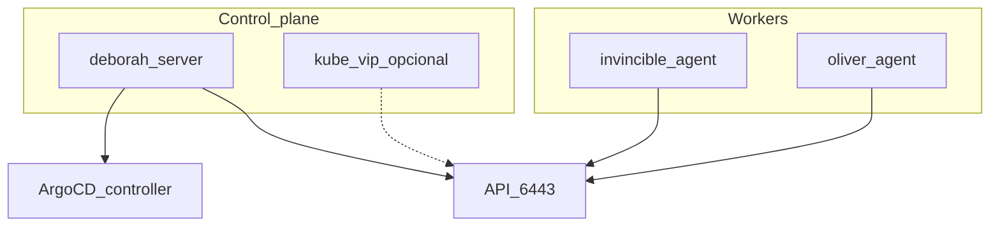

# Fase 3 — K3s

## Objetivo

Management cluster **K3s (distribución ligera de Kubernetes)** en 3 nodos (CP en deborah, workers en invincible y
oliver), con controller **Argo CD** listo para GitOps.

## Qué aprendes

K3s como Kubernetes ligero bare-metal: server/agent, CNI (Container Network Interface) configurable
(Flannel por defecto), deshabilitar Traefik/ServiceLB para controlar Ingress y
LoadBalancer vía GitOps después.

## Stack de esta fase



- **[K3s](https://docs.k3s.io/)** — Management cluster; Fase 3.
- **CNI** — [Flannel](https://github.com/flannel-io/flannel) (default), [Canal](https://docs.tigera.io/calico/latest/getting-started/kubernetes/flannel/flannel), [Calico](https://docs.tigera.io/calico/latest/about/), [Cilium](https://docs.cilium.io/); Fase 3.
- **[kube-vip](https://kube-vip.io/)** — VIP (IP virtual) opcional `:6443`; fork Fase 3.
- **[Argo CD](https://argo-cd.readthedocs.io/)** — Controller bootstrap; Fase 3 → GitOps Fase 4.
- **[Ansible](https://docs.ansible.com/)** — `playbook-k3s.yml`.

Profundización: [Opciones del playbook](../k3s/playbook-options.md) · [Catálogo roles Ansible](../ansible/index.md) · [K3s manual (legacy)](../k3s/index.md)

## Antes de empezar

- [ ] [Fases 0](fase-0-preparacion.md), [1](fase-1-red.md) y [2](fase-2-incus.md) completadas.
- [ ] Incus cluster healthy (opcional pero recomendado antes de CAPN).

## Ejecutar

=== "Recomendado (Ansible)"

    Las opciones del playbook se activan en
    [`group_vars/incus_cluster/k3s_install.yml`](https://github.com/symintel/homelab/blob/main/ansible/group_vars/incus_cluster/k3s_install.yml),
    no por línea de comandos. Hoy vienen activadas ArgoCD
    (`gitops_argocd`), las etiquetas de nodos (`node_labels`) y el kubeconfig
    local (`fetch_kubeconfig`), con CNI (Container Network Interface) Calico.
    Revisa el archivo y corre:

    ```bash
    cd ansible
    ansible-playbook -i inventory.ini playbook-k3s.yml
    ```

    !!! warning "No uses `-e k3s_install.<opción>=…`"
        Ansible lo ignora: `k3s_install` es un diccionario y una clave con
        puntos en `-e` no lo modifica. Y pasar `-e` con JSON es peor:
        reemplaza el diccionario entero y se pierden `core.version`,
        `cluster_cidr`, etc. Para cambiar una opción, edita el archivo.

=== "Alternativa manual"

    Pasos curl en [K3s — instalación manual](../k3s/index.md). Usar solo si
    Ansible no está disponible; el camino soportado es el playbook.

## Opciones

| Si necesitas… | En `k3s_install.yml` | Hoy | Doc |
|---|---|---|---|
| VIP estable del API | `kube_vip.enabled: true` | desactivado | [playbook-options](../k3s/playbook-options.md) |
| Etiquetas Longhorn/arch | `node_labels.enabled: true` | activado | [playbook-options](../k3s/playbook-options.md) |
| Kubeconfig local | `fetch_kubeconfig.enabled: true` | activado | [playbook-options](../k3s/playbook-options.md) |
| OS hardening | `os_hardening.enabled: true` | desactivado | [playbook-options](../k3s/playbook-options.md) |

| Decisión | Opción A (default) | Opción B |
|---|---|---|
| API K3s | IP fija deborah `192.168.20.5` | kube-vip `192.168.20.4` |
| CNI | Calico (configurado en este repo) | Flannel `vxlan` (default de K3s), Canal o Cilium (`k3s_install.core.cni`) |

### CNI

| CNI | Variable | Notas |
|---|---|---|
| **Flannel** (default de K3s) | `cni: flannel` | Embebido en K3s; `flannel_backend: vxlan` o `host-gw` |
| **Canal** | `cni: canal` | Flannel overlay + políticas Calico; rol `k3s_cni` |
| **Calico** | `cni: calico` | NetworkPolicy, BGP opcional; `--flannel-backend=none` |
| **Cilium** | `cni: cilium` | eBPF, Hubble; validar en ARM64 (deborah) |

El CNI se elige en `k3s_install.core.cni` (hoy: `calico`), **antes** de
instalar K3s: cambiarlo en un clúster ya instalado obliga a reinstalarlo.

```yaml
# group_vars/incus_cluster/k3s_install.yml
k3s_install:
  core:
    cni: calico  # flannel | canal | calico | cilium
```

Detalle: [playbook-options — CNI](../k3s/playbook-options.md#cni).

<div class="card">
  <div class="card-kicker">Análisis de trade-offs</div>
  <div class="option-grid">
    <div class="card-col">
      <div class="card-title">Ansible (<code>playbook-k3s.yml</code>)</div>
      <div class="text-muted">Flags en <code>group_vars</code>; rol <code>k3s_cni</code></div>
      <div class="text-muted">Requiere SSH y orden server → CNI → agents</div>
    </div>
    <div class="card-col">
      <div class="card-title">curl manual</div>
      <div class="text-muted">Escape hatch</div>
      <div class="text-muted">Sin idempotencia; fácil olvidar <code>--disable traefik</code></div>
    </div>
    <div class="card-col">
      <div class="card-title">IP fija <code>192.168.20.5</code></div>
      <div class="text-muted">Sin componentes extra</div>
      <div class="text-muted">Si el CP migra, hay que reconfigurar agents</div>
    </div>
    <div class="card-col">
      <div class="card-title">kube-vip <code>192.168.20.4</code></div>
      <div class="text-muted">VIP estable del API</div>
      <div class="text-muted">Daemon adicional; distinto de MetalLB</div>
    </div>
    <div class="card-col">
      <div class="card-title">Flannel</div>
      <div class="text-muted">Cero fricción; bajo consumo</div>
      <div class="text-muted">Sin NetworkPolicy nativa</div>
    </div>
    <div class="card-col">
      <div class="card-title">Canal</div>
      <div class="text-muted">Políticas Calico sobre overlay</div>
      <div class="text-muted">Proyecto legacy; dos stacks</div>
    </div>
    <div class="card-col">
      <div class="card-title">Calico</div>
      <div class="text-muted">NetworkPolicy madura; BGP en L2</div>
      <div class="text-muted">Más pods/RAM; IP pools</div>
    </div>
    <div class="card-col">
      <div class="card-title">Cilium</div>
      <div class="text-muted">eBPF; políticas L3–L7; Hubble</div>
      <div class="text-muted">Más CPU; kernel/BPF; probar en deborah</div>
    </div>
    <div class="card-col">
      <div class="card-title"><code>node_labels</code> / <code>fetch_kubeconfig</code></div>
      <div class="text-muted">Longhorn y kubeconfig local listos</div>
      <div class="text-muted">Play más largo; labels mal puestas afectan storage</div>
    </div>
  </div>
</div>

## Verificar

```bash
# En deborah o con kubeconfig
sudo k3s kubectl get nodes
# 3 nodos Ready
sudo k3s kubectl get pods -n argocd
# argocd-server Running (si gitops_argocd.enabled=true)
```

Espera pods `argocd-server` en `Running` antes de la Fase 4.

## Si falla

| Síntoma | Revisar |
|---|---|
| Agent no une | Token, `K3S_URL`, firewall `:6443` |
| Traefik residual | `--tags traefik` o rol `k3s_cleanup_traefik` |
| CP caído tras reboot | `systemctl enable --now k3s` en deborah |

## Siguiente

**[→ Fase 4 — GitOps](fase-4-gitops.md)**
