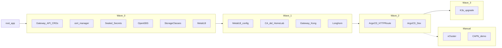
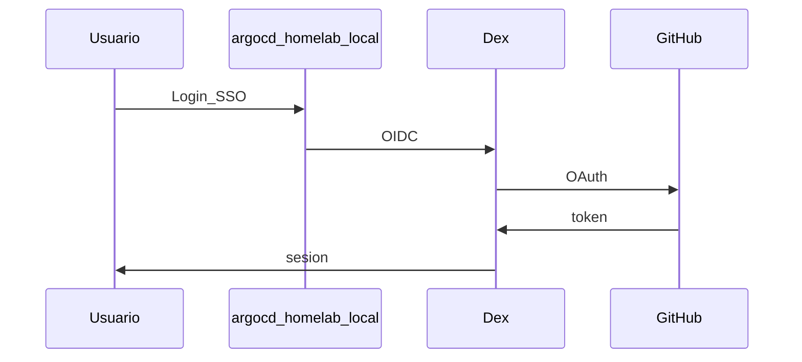

# Fase 4 — GitOps

## Objetivo

Desplegar la plataforma completa vía **Argo CD** desde
[`gitops/`](https://github.com/symintel/gitops): storage, MetalLB, Gateway API, Dex +
GitHub OAuth, y waves de operaciones.

## Qué aprendes

**GitOps**: el clúster converge al estado declarado en Git; un solo
`kubectl apply` (ApplicationSet `homelab-root`) y Argo CD sincroniza el resto. Separación clara:
Ansible bootstrap vs GitOps continuo.

## Stack de esta fase



- **[Argo CD](https://argo-cd.readthedocs.io/)** — GitOps; toda la fase.
- **[MetalLB](https://metallb.universe.tf/)** — LoadBalancer LAN (red local); wave 0–1.
- **[Gateway API](https://gateway-api.sigs.k8s.io/)** — API estándar de Kubernetes para publicar servicios HTTP(S) (reemplaza a `Ingress`); sus CRDs van en wave 0.
- **[Kong Ingress Controller](https://developer.konghq.com/kubernetes-ingress-controller/)** (KIC) — controlador de Gateway API predeterminado; wave 1. Alternativas: [Traefik](https://doc.traefik.io/traefik/routing/providers/kubernetes-gateway/) y [NGINX Gateway Fabric](https://docs.nginx.com/nginx-gateway-fabric/).
- **[cert-manager](https://cert-manager.io/docs/)** — emite los certificados TLS con una CA (autoridad certificadora) propia del HomeLab; waves 0–1.
- **[OpenEBS](https://openebs.io/docs)** / **[Longhorn](https://longhorn.io/docs/)** — Storage; waves 0–1.
- **[Sealed Secrets](https://github.com/bitnami-labs/sealed-secrets)** — Secretos en git; wave 0.
- **[Dex](https://dexidp.io/docs/)** + **[GitHub](https://docs.github.com/en/apps/oauth-apps)** — SSO (inicio de sesión único); wave 2.
- **[1Password Python SDK](https://github.com/1Password/onepassword-sdk-python)** — OAuth fuera de git; paso 4.7 (app local, DesktopAuth).
- **[system-upgrade-controller](https://github.com/rancher/system-upgrade-controller)** — Upgrades K3s (distribución ligera de Kubernetes); wave 3.

!!! note "Por qué Gateway API y no Ingress"
    El proyecto Ingress NGINX se archivó en marzo de 2026 y `Ingress` está
    congelado en Kubernetes. El HomeLab publica todo con `Gateway` y
    `HTTPRoute`. Se activa **un solo** controlador a la vez (Kong, Traefik o
    NGINX Gateway Fabric): ver [Cambiar el controlador de Gateway](../operacion/cambiar-gateway.md).

Profundización: [Catálogo GitOps](../gitops/index.md) · [Storage](../storage/index.md) · [Secretos](../secrets/index.md)

## Antes de empezar

- [ ] [Fase 3 — K3s](fase-3-k3s.md) completada (`argocd-server` Running).
- [ ] `kubectl` configurado en tu estación.
- [ ] [Fase 0 — GitHub y 1Password](fase-0-preparacion.md#github-y-1password-org-symintel-manual-una-sola-vez)
      completado (Apps, repos e items de 1Password).
- [ ] En el router, el rango **`192.168.23.200–192.168.23.220`** fuera del
      DHCP (reservado): es el pool de MetalLB para los servicios
      `LoadBalancer`, como el Gateway ([esquema de IPs](../networking/index.md#esquema-de-ips)).

---

## 4.1 — Acceso kubectl

Copia a tu estación el kubeconfig del control plane (`deborah`), como
`~/.kube/homelab-k3s.yaml`: es el archivo que usan los playbooks y los
procedimientos de esta guía. Si en la Fase 3 corriste `playbook-k3s.yml`
completo, ya lo tienes (`k3s_install.fetch_kubeconfig.enabled: true`).

=== "Recomendado (Ansible)"

    ```bash
    cd ansible
    ansible-playbook -i inventory.ini playbook-k3s.yml --tags kubeconfig
    cd ..
    ```

    El rol `k3s_fetch_kubeconfig` lee `/etc/rancher/k3s/k3s.yaml` en
    `deborah`, cambia la dirección del API (Application Programming
    Interface) por la IP real del control plane (o la VIP si usas kube-vip)
    y lo guarda en `~/.kube/homelab-k3s.yaml` con permisos `0600`.

=== "Alternativa manual"

    El archivo en el nodo es de root con permisos `600`, así que se lee con
    `sudo`; después se cambia `127.0.0.1` por la IP del control plane:

    ```bash
    mkdir -p ~/.kube
    ssh amaceo@192.168.20.5 sudo cat /etc/rancher/k3s/k3s.yaml \
      | sed 's#https://127.0.0.1:6443#https://192.168.20.5:6443#' \
      > ~/.kube/homelab-k3s.yaml
    chmod 600 ~/.kube/homelab-k3s.yaml
    ```

Úsalo y comprueba el acceso:

```bash
export KUBECONFIG=~/.kube/homelab-k3s.yaml
kubectl get nodes
```

!!! tip "Alternativa web (Fase 5)"
    Tras desplegar [vCluster Platform](fase-5-vcluster.md), puedes descargar
    el kubeconfig del **management K3s** desde
    `https://vcluster.homelab.local` (connected cluster), con SSO GitHub vía Dex.
    El kubeconfig local de arriba sigue siendo el camino para el bootstrap, antes de la Fase 5.

<div class="card">
  <div class="card-kicker">Acceso kubectl</div>
  <div class="option-grid">
    <div class="card-col">
      <div class="card-title">Kubeconfig local (Ansible o manual)</div>
      <div class="text-muted">Funciona antes del Gateway y vCluster</div>
      <div class="text-muted">Archivo en disco; rotación manual</div>
    </div>
    <div class="card-col">
      <div class="card-title">vCluster Platform (Fase 5)</div>
      <div class="text-muted">Kubeconfig vía SSO; connected cluster</div>
      <div class="text-muted">Requiere Fase 4+5 y permisos asignados</div>
    </div>
  </div>
</div>

---

## 4.2 — Bootstrap GitOps (ApplicationSet)

Un único apply manual; a partir de aquí Argo CD gestiona el resto (auto).

**Primero, los secretos de plataforma.** `symintel/gitops` es privado: sin
las credenciales de la App `symintel-argocd`, ArgoCD no puede leer el repo. El playbook los lee de
1Password y los deja en el clúster. Igual que en la Fase 0, la app de
1Password tiene que estar desbloqueada y `ONEPASSWORD_ACCOUNT_NAME` con el
nombre de tu cuenta (el de la barra lateral de la app).

```bash
export ONEPASSWORD_ACCOUNT_NAME="Mi Cuenta"  # tu cuenta
cd ansible
ansible-playbook -i inventory.ini playbook-platform-secrets.yml
cd ..
```

| Secret | Namespace | Para qué |
|---|---|---|
| `repo-gitops` | `argocd` | App `symintel-argocd` para `https://github.com/symintel/gitops.git` |
| `arc-runners-github-app` | `arc-runners` | Registro del runner de ARC |
| `symintel-terraform-app`, `tofu-vars` | `arc-runners` | Credenciales de OpenTofu (`TF_VAR_*`) para el pipeline |

También crea el namespace `terraform`, donde OpenTofu guarda su state. Usa
siempre `~/.kube/homelab-k3s.yaml`, no el contexto actual de `kubectl`. Es
idempotente: re-córrelo cuando rotes algo en 1Password. Detalle:
[Plataforma symintel — GitHub](../symintel/github.md#paso-3-cluster-y-secretos-de-plataforma).

**Después, el ApplicationSet de bootstrap:**

```bash
kubectl apply -f gitops/bootstrap/root-appset.yaml
```

[`bootstrap/root-appset.yaml`](https://github.com/symintel/gitops/blob/main/bootstrap/root-appset.yaml)
genera una Application raíz, `homelab-root`, con las apps que están
**descomentadas** en su lista `apps`. Al principio solo está `argocd` (ArgoCD administrándose a sí mismo)
(Dex, RBAC y el health check que necesitan las olas), para ir probando cada
componente de a uno:

1. Descomenta la siguiente app de la lista (van en orden de ola) y haz push
   al repo `gitops`.
2. **Vuelve a aplicar el ApplicationSet**: ArgoCD no lo gestiona (lo creaste
   tú con `kubectl`), así que el push solo no cambia la lista:

    ```bash
    kubectl apply -f gitops/bootstrap/root-appset.yaml
    ```

3. ArgoCD la despliega; espera a que quede `Healthy`
   (`kubectl get applications -n argocd`).
4. Sigue con la próxima.

**Olas:** como todas las apps se sincronizan juntas en `homelab-root`, ArgoCD
respeta su anotación `argocd.argoproj.io/sync-wave` y despliega por olas
(-1 → 0 → 1 → 2 → 3), esperando a que cada una esté `Healthy` antes de la
siguiente. Las secciones 4.3 a 4.9 siguen ese orden.

Para desactivar una app, vuelve a comentarla: `homelab-root` borra su
Application (los recursos que creó quedan en el clúster).

**Verificar:**

```bash
kubectl get applications -n argocd
```

UI (interfaz de usuario) provisional (sin Gateway aún; `argocd-server` habla HTTP, abre `http://localhost:8080`):

```bash
kubectl port-forward svc/argocd-server -n argocd 8080:80
kubectl get secret argocd-initial-admin-secret -n argocd \
  -o jsonpath='{.data.password}' | base64 -d; echo
```

---

## 4.3 — Wave 0: secretos + storage + MetalLB controller

Espera `Healthy` en: `gateway-api`, `cert-manager`, `sealed-secrets`, `openebs`, `homelab-storage`, `metallb`.

| Application | Producto | Para qué sirve |
|---|---|---|
| `gateway-api` | [Gateway API](https://gateway-api.sigs.k8s.io/) | CRDs (Custom Resource Definition) `Gateway`, `HTTPRoute`, etc., canal standard |
| `cert-manager` | [cert-manager](https://cert-manager.io/docs/) | Emite certificados; crea el de cada Gateway con la anotación `cert-manager.io/cluster-issuer` |
| `sealed-secrets` | [Sealed Secrets](https://github.com/bitnami-labs/sealed-secrets) | Descifra `SealedSecret` en el clúster; usa la llave de 1Password (item `sealed-secrets`) si el playbook de secretos ya la creó |
| `openebs` | [OpenEBS](https://openebs.io/docs) | LocalPV default |
| `homelab-storage` | — | StorageClasses `openebs-hostpath` y `longhorn-mixto` ([cuál usar y sus trade-offs](../storage/index.md#storageclasses-del-cluster)) |
| `metallb` | [MetalLB](https://metallb.universe.tf/) | Controller LoadBalancer |

**Verificar:**

```bash
kubectl get storageclass
kubectl get pods -n metallb-system
kubectl get pods -n openebs
```

---

## 4.4 — Wave 1: pool MetalLB + Gateway + Longhorn

Espera `Healthy` en: `metallb-config`, `cert-manager-config`, `kong` y `longhorn`.

| Application | Producto | Para qué sirve |
|---|---|---|
| `metallb-config` | [MetalLB](https://metallb.universe.tf/) | Pool L2 `192.168.23.200–.220` |
| `cert-manager-config` | [cert-manager](https://cert-manager.io/docs/) | CA propia del HomeLab (`ClusterIssuer homelab-ca`) |
| `kong` | [Kong Ingress Controller](https://developer.konghq.com/kubernetes-ingress-controller/) | Controlador de Gateway API y `Gateway homelab` (HTTP 80 y HTTPS 443, `*.homelab.local`) |
| `longhorn` | [Longhorn](https://longhorn.io/docs/) | Storage replicado HA |

```bash
kubectl get gateway homelab -n gateway
# ADDRESS en rango 192.168.23.200–.220 y PROGRAMMED=True
```

**Verificar:**

```bash
kubectl get ipaddresspool -n metallb-system
kubectl get pods -n longhorn-system
```

---

## 4.5 — Wave 2: ArgoCD en LAN + Dex

Espera `Healthy` en `argocd-route` y `argocd`.

| Recurso | Producto | Para qué sirve |
|---|---|---|
| `argocd-route` | [Gateway API](https://gateway-api.sigs.k8s.io/) | `HTTPRoute` hacia `https://argocd.homelab.local` (el Gateway termina el TLS; `argocd-server` queda en HTTP con `server.insecure`) |
| `argocd` | [ArgoCD](https://argo-cd.readthedocs.io/) y [Dex](https://dexidp.io/docs/) | ArgoCD se actualiza solo (tag `stable`); suma el connector GitHub, los staticClients de vCluster e Incus UI, el RBAC y el health check de Application ([Actualizar ArgoCD](../operacion/actualizar-argocd.md)) |

---

## 4.6 — kube-vip vs MetalLB

| | [kube-vip](https://kube-vip.io/) | [MetalLB](https://metallb.universe.tf/) |
|---|---|---|
| **Quién lo instala** | Ansible (Fase 3) | Argo CD (Fase 4) |
| **Qué VIPea** | Solo API `:6443` | Services `LoadBalancer` |
| **Config clave** | `svc_enable=false` | Pool `192.168.23.200–.220` |

No uses kube-vip para Services de aplicación.

### Análisis de trade-offs — kube-vip vs MetalLB

| Alternativa | Ventaja | Coste / riesgo |
|---|---|---|
| kube-vip (Fase 3) | VIP fija solo para API `:6443` | No expone Gateways ni Services LB |
| MetalLB (Fase 4) | `LoadBalancer` para el Gateway y apps | Pool L2 `192.168.23.200–.220` debe estar libre en LAN |
| Ambos (default HomeLab) | Responsabilidades separadas | Dos mecanismos VIP distintos — no mezclar roles |

---

## 4.7 — Secretos OAuth (GitHub + vCluster + Incus UI)

Los valores sensibles **no van en git**. Guárdalos en 1Password e inyecta
`argocd-secret`.

!!! note "OAuth App ya creada en la Fase 0"
    Si seguiste la [Fase 0](fase-0-preparacion.md#github-y-1password-org-symintel-manual-una-sola-vez),
    la OAuth App `Symintel Dex` y sus campos `GITHUB_*` ya existen: solo
    falta correr el playbook de más abajo.

**GitHub OAuth App** en la **org `symintel`** ([symintel → Settings → Developer settings → OAuth Apps → New OAuth App](https://github.com/organizations/symintel/settings/applications/new)).
Creada en la org, Dex puede leer sus teams sin aprobarla como app de terceros:

| Campo GitHub | Valor |
|---|---|
| Application name | `Symintel Dex` (o similar) |
| Homepage URL | `https://argocd.homelab.local` |
| Redirect URIs | `https://argocd.homelab.local/api/dex/callback` (solo esta) |

**Homepage URL** es informativa; el campo crítico es **Redirect URIs** (en versiones anteriores de GitHub se llamaba *Authorization callback URL*): tiene que ser exactamente la URL de arriba.

Ítems 1Password (cuenta **personal**, bóveda **`HomeLab`** por defecto): ver
[`argocd/secrets/1password.md`](https://github.com/symintel/gitops/blob/main/argocd/secrets/1password.md).

Probar lectura (mismo módulo que el apply):

```bash
export ONEPASSWORD_ACCOUNT_NAME="Mi Cuenta"   # tu cuenta personal
export ONEPASSWORD_VAULT="HomeLab"             # o HomeLab
python3 ansible/scripts/test-1password.py GITHUB_CLIENT_ID
```

Inyectar en el clúster (recomendado — Ansible):

```bash
cd ansible
ansible-playbook -i inventory.ini playbook-dex-oauth-secrets.yml
```

El campo `VCLUSTER_CLIENT_SECRET` se genera en
1Password automáticamente si no existe. Crea antes en 1Password (manual)
`GITHUB_CLIENT_ID` y `GITHUB_CLIENT_SECRET` desde la OAuth App de GitHub.

Alternativa script Python:

```bash
pip install onepassword-sdk
python3 gitops/argocd/secrets/apply-from-1password.py.example
kubectl rollout restart deployment argocd-dex-server -n argocd
```

Connector **GitHub** (solo el team `devops` de la org `symintel`) y staticClients **vCluster** e **Incus UI**
en [`dex.config`](https://github.com/symintel/gitops/blob/main/argocd/config/dex.config).

`VCLUSTER_CLIENT_SECRET` **no** viene de GitHub.
Ansible lo genera en 1Password si falta y lo aplica según destino. Incus **no usa secreto**:
es un cliente OIDC público (PKCE) en Dex.

| Campo | Destinos (tags Ansible) |
|---|---|
| `VCLUSTER_CLIENT_SECRET` | `argocd-secret` (`argocd`) + Helm Platform (`vcluster`) |

### Probar el login: URLs y qué esperar

Primero comprueba que las cuatro claves llegaron a `argocd-secret` y que Dex se reinició:

```bash
kubectl -n argocd get secret argocd-secret -o jsonpath='{.data}' | python3 -c "import sys,json;print(list(json.load(sys.stdin)))"
kubectl -n argocd get pods -l app.kubernetes.io/name=argocd-dex-server
```

Tienen que aparecer `dex.github.clientId`, `dex.github.clientSecret` y
`dex.vcluster.platform.clientSecret`. Las URLs necesitan el [DNS de `*.homelab.local`](#48-dns-de-homelablocal)
(o `/etc/hosts`); el certificado lo firma la CA del HomeLab, así que el navegador avisa hasta que la
importes (y `curl` necesita `-k`).

| Qué probar | URL | Qué debes ver |
|---|---|---|
| **ArgoCD** (UI) | `https://argocd.homelab.local` | Pantalla de login con el botón **Log in via GitHub**. Al pulsarlo pasa por GitHub y vuelve a ArgoCD con las Applications |
| ArgoCD (HTTP) | `http://argocd.homelab.local` | Redirige (`301`) a la versión HTTPS |
| ArgoCD (API) | `https://argocd.homelab.local/api/version` | `{"Version":"v3.x.x"}`: el servidor responde a través del Gateway |
| **Dex** (descubrimiento) | `https://argocd.homelab.local/api/dex/.well-known/openid-configuration` | JSON con `"issuer": "https://argocd.homelab.local/api/dex"` |
| Dex (callback) | `https://argocd.homelab.local/api/dex/callback` | **No se abre a mano.** Es la URL que tiene que estar en *Redirect URIs* de la OAuth App de GitHub |
| **vCluster Platform** | `https://vcluster.homelab.local` | Login SSO con GitHub (Fase 5; antes no existe) |
| **Incus UI** | `https://incus.homelab.local:8443` | **Login with SSO** → GitHub (ver más abajo) |

Desde la terminal:

```bash
curl -sk https://argocd.homelab.local/api/version
curl -sk https://argocd.homelab.local/api/dex/.well-known/openid-configuration
curl -s -o /dev/null -w "%{http_code} -> %{redirect_url}\n" http://argocd.homelab.local/
```

| Si ves… | Causa | Qué hacer |
|---|---|---|
| GitHub responde **404** y la URL trae `client_id=.github.clientId` | Faltan las claves `dex.*` en `argocd-secret`: Dex no pudo sustituir `$dex.github.clientId` | Corre el playbook de arriba (`--tags argocd`) y vuelve a probar |
| GitHub dice **redirect_uri mismatch** | *Redirect URIs* de la OAuth App distinto | Debe ser exactamente `https://argocd.homelab.local/api/dex/callback` |
| El login termina bien pero ArgoCD **no muestra Applications** | Tu cuenta no está en el team `devops` de `symintel` | Agrégala al team; el claim `groups` es `symintel:devops` |
| `invalid_client` o `bad credentials` | `GITHUB_CLIENT_SECRET` incorrecto o rotado | Actualiza el campo en 1Password y vuelve a correr el playbook |

### Incus UI OIDC

Requisitos: UI instalada en [Fase 2](fase-2-incus.md#ui-de-administracion),
`argocd` Healthy, secretos inyectados y Dex reiniciado.

Incus (7.x) solo conoce cinco claves OIDC: `oidc.issuer`, `oidc.client.id`, `oidc.audience`,
`oidc.claim` y `oidc.scopes`. **No** tiene `oidc.client.secret`, ni `oidc.groups.claim`, ni el
comando `incus auth` (esas son de LXD). Por eso en Dex el cliente `incus-ui` es **público**
(`public: true`, PKCE, sin secreto): está en [`dex.config`](https://github.com/symintel/gitops/blob/main/argocd/config/dex.config).

**Ansible** (recomendado) — `group_vars/dex_oauth_secrets.yml` ya trae `apply_incus: true`. Con
las claves `dex.*` ya cargadas ([Probar el login](#probar-el-login-urls-y-que-esperar)), corre:

```bash
export KUBECONFIG=~/.kube/homelab-k3s.yaml
export ONEPASSWORD_ACCOUNT_NAME="Mi Cuenta"
cd ansible
ansible-playbook -i inventory.ini playbook-dex-oauth-secrets.yml --tags ensure,argocd,incus
```

Eso aplica las claves en `argocd-secret`, reinicia Dex, instala la CA del HomeLab en **invincible**
y configura `oidc.issuer` y `oidc.client.id` en Incus.

!!! warning "Incus tiene que confiar en la CA del HomeLab"
    Incus valida el certificado HTTPS de Dex (`https://argocd.homelab.local/api/dex`), que
    firma la CA propia del HomeLab. Si `invincible` no la conoce, el login falla (`curl` desde
    el nodo da `ssl_verify=20`). El playbook, con el tag `incus`, la lee del clúster
    (`kubectl -n cert-manager get secret homelab-ca`), la instala en
    `/usr/local/share/ca-certificates/` y **reinicia el servicio `incus`** (las instancias
    siguen corriendo; la API queda unos segundos sin responder). Solo ese paso:
    `--tags incus_ca`.

Comprueba en el nodo que ya confía y que OIDC quedó configurado:

```bash
curl -s -o /dev/null -w "%{http_code} ssl_verify=%{ssl_verify_result}\n" https://argocd.homelab.local/api/dex/.well-known/openid-configuration
incus config get oidc.issuer
incus config get oidc.client.id
```

Deben dar `200 ssl_verify=0`, `https://argocd.homelab.local/api/dex` e `incus-ui`.

Alternativa manual en el nodo bootstrap (**invincible**), después de instalar la CA
([manual](../incus/cluster-setup.md#oidc-via-dex-fase-4)):

```bash
incus config set oidc.issuer=https://argocd.homelab.local/api/dex
incus config set oidc.client.id=incus-ui
```

#### Quién puede entrar y qué puede hacer

- **Quién inicia sesión:** el conector GitHub de Dex solo deja pasar a miembros del team
  `devops` de la org `symintel` (`orgs`/`teams` en `dex.config`). Quien no está en el team no
  llega a Incus.
- **Qué puede hacer:** con la configuración por defecto de Incus, cualquier usuario que se
  autentica con el proveedor OIDC tiene **acceso completo** al servidor. Para permisos
  granulares (solo un proyecto, solo lectura) Incus usa [OpenFGA](https://linuxcontainers.org/incus/docs/main/authentication/)
  como motor de autorización: no está configurado en el HomeLab. Mientras tanto, el control es
  la pertenencia al team `devops`.

Verificar:

- `https://incus.homelab.local:8443` → **Login with SSO** → GitHub → entras a la UI de Incus
- Una cuenta que **no** está en el team `devops` → GitHub/Dex rechaza el login antes de llegar a Incus

### Flujo SSO



| Decisión | Opción A (default HomeLab) | Opción B |
|---|---|---|
| Secretos OAuth | SDK local; cuenta **Personal**, bóveda **`HomeLab`** | `ONEPASSWORD_ACCOUNT_NAME` / `ONEPASSWORD_VAULT` o `kubectl patch` |

### Análisis de trade-offs — secretos OAuth

| Alternativa | Ventaja | Coste / riesgo |
|---|---|---|
| Ansible + 1Password SDK | Genera `INCUS_*` / `VCLUSTER_*`; idempotente | App 1Password desbloqueada en la estación |
| Script Python manual | Mismo SDK sin playbook | Pasos sueltos; fácil olvidar restart Dex |
| `kubectl patch` directo | Sin 1Password | Secretos en historial; no reproducible |

---

## 4.8 — DNS de `*.homelab.local`

Los nombres los resuelve el DNS de la LAN (BIND en `deborah`,
[`playbook-bind-dns.yml`](https://github.com/symintel/homelab/blob/main/ansible/playbook-bind-dns.yml)).
La zona `homelab.local` trae:

| Registro | Apunta a |
|---|---|
| `incus.homelab.local` | invincible (`192.168.20.6`) |
| `argocd.homelab.local`, `vcluster.homelab.local` | el Gateway: `gateway_ip` = `192.168.23.200` (primera IP del pool de MetalLB) |
| `*.homelab.local` (comodín) | el Gateway: los `HTTPRoute` nuevos funcionan sin tocar el DNS |

La IP del Gateway es **fija**: los Service de `kong`, `traefik` y `nginx-gateway`
la piden con una anotación de MetalLB, y la misma variable `gateway_ip`
(`ansible/group_vars/all.yml`) alimenta el DNS. Si la cambias, cámbiala en los dos
lados. Aplica el DNS (desde `ansible/` en `homelab`):

```bash
ansible-playbook -i inventory.ini playbook-bind-dns.yml
dig @192.168.20.5 argocd.homelab.local +short   # 192.168.23.200
```

Tu estación tiene que usar `192.168.20.5` como DNS. Si no puedes, el respaldo es
`/etc/hosts`:

```
192.168.23.200  argocd.homelab.local vcluster.homelab.local
192.168.20.6    incus.homelab.local
```

Comprueba que el Gateway tiene esa IP:

```bash
kubectl get gateway homelab -n gateway -o jsonpath='{.status.addresses[0].value}'; echo
```

El certificado lo firma la CA del HomeLab: para que el navegador confíe,
importa su certificado raíz (`kubectl -n cert-manager get secret homelab-ca -o jsonpath='{.data.ca\.crt}' | base64 -d > homelab-ca.crt`)
o usa `curl -k` mientras tanto.

```bash
curl -kI https://argocd.homelab.local
curl -kI https://incus.homelab.local:8443
```

---

## 4.9 — Wave 3: actualizaciones K3s (opcional)

Espera `Healthy` en `k3s-upgrade` ([system-upgrade-controller](https://github.com/rancher/system-upgrade-controller)).

---

## 4.10 — Checklist Fase 4

| Comprobación | Criterio |
|---|---|
| Nodos Ready | `kubectl get nodes` → 3 Ready |
| Apps auto Healthy | `kubectl get applications -n argocd` |
| Storage default | PVC `openebs-hostpath` provisiona |
| Gateway responde | `curl -k https://argocd.homelab.local` |
| SSO Dex | Login GitHub en ArgoCD |
| Incus UI OIDC | Login SSO en `https://incus.homelab.local:8443` |
| Runner ARC | `arc-runners` Healthy; runner listado en *symintel → Settings → Actions → Runners* ([4.11](#411-arc-y-pipeline-de-opentofu)) |
| Pipeline OpenTofu | Primer `tofu apply` de `infra` en verde; existe `terraform/tfstate-default-github` ([4.11](#411-arc-y-pipeline-de-opentofu)) |

Checklist global (URLs, `/etc/hosts`, nodos): **[Resumen del HomeLab](resumen-homelab.md)**.

---

## 4.11 — ARC y pipeline de OpenTofu

Con `arc-helm-repo`, `arc-controller`, `terraform-rbac` y `arc-runners` descomentadas en `homelab-root`, ArgoCD despliega el runner de GitHub Actions:

| Application | Qué despliega |
|---|---|
| `arc-controller` | Controller de ARC (`arc-systems`) |
| `terraform-rbac` | ServiceAccount `tofu-runner`, con acceso solo a Secrets/Leases del namespace `terraform` |
| `arc-runners` | El único scale set (hasta 3 runners), para CI, deploys y OpenTofu |
| `arc-runners` (caché) | Volumen compartido `arc-cache` montado en `/cache` de los runners ([Caché de los runners](../operacion/cache-arc.md)) |

```bash
kubectl get applications -n argocd | grep -E 'arc|terraform'
kubectl get pods -n arc-systems        # controller + listener de arc-runners
```

El runner aparece en *symintel → Settings → Actions → Runners*.

**Primer pipeline.** En `symintel/infra`, lanza *Actions → tofu → Run
workflow* sobre `main`, o haz un push a `main`. El workflow reusable
[`tofu.yml`](https://github.com/symintel/core-pipelines/blob/main/.github/workflows/tofu.yml)
corre en `arc-runners`: hace `plan` en los PRs (pull requests) y `apply` en `main`. La
primera ejecución crea el repo `api` con sus environments y secrets FTP (File Transfer Protocol).

```bash
kubectl -n terraform get secret tfstate-default-github   # state tras el primer apply
```

A partir de acá, cada repo nuevo se agrega con el
[procedimiento de rutina — Agregar un repo](../operacion/agregar-repo.md): credenciales FTP en
1Password (si despliega), entrada en el mapa de
[`infra`](https://github.com/symintel/infra) por PR y el
workflow de CI/CD.

---

## Opciones post-Fase 4

| Componente | Sync | Siguiente paso |
|---|---|---|
| [vCluster Platform](https://www.vcluster.com/docs/platform/) | manual | [Fase 5](fase-5-vcluster.md) |
| [CAPN](https://capn.linuxcontainers.org/) | manual | [Fase 6](fase-6-capn.md) |
| CNI externo (Canal / Calico / Cilium) | manual | [Fase 3 — CNI](fase-3-k3s.md#cni); normalmente vía Ansible `k3s_cni`, no Fase 4 |

### Análisis de trade-offs — post-Fase 4

| Alternativa | Ventaja | Coste / riesgo |
|---|---|---|
| Terminar en Fase 4 | Management GitOps completo; menos superficie | Sin vClusters ni workload clusters CAPN |
| Fase 5 vCluster | Kubeconfig web; clústeres virtuales ligeros | Más RAM en K3s; OAuth + permisos Platform |
| Fase 6 CAPN | Clusters kubeadm reales sobre Incus | Alto consumo RAM; sync manual obligatorio |
| CNI vía GitOps | Reinstalar Canal/Calico/Cilium sin Ansible | Solo con K3s en `flannel-backend=none`; no mezclar CNIs |
| Sync manual (5/6) | No borra clusters efímeros por prune | Paso extra en Argo CD UI |

## Si falla

| Síntoma | Revisar |
|---|---|
| Application `Degraded` | `kubectl describe application -n argocd <nombre>` |
| Gateway sin dirección | `metallb-config`, pool libre |
| SSO falla | Secretos 1Password + restart `argocd-dex-server` |
| `homelab-root` `ComparisonError` / repo no accesible | Falta `argocd/repo-gitops`, o la App `symintel-argocd` no está instalada en `symintel/gitops`: re-correr `playbook-platform-secrets.yml` |
| `arc-runners` `OutOfSync` y el pod del listener se reinicia cada pocos minutos | ArgoCD poda en bucle los recursos que crea el controlador de ARC (`AutoscalingListener`, `Role`, `RoleBinding`: copian la etiqueta `app.kubernetes.io/instance`). Se corrige con `application.resourceTrackingMethod: annotation` en `argocd-cm` (ya está en `gitops/argocd/config`). Comprueba: `kubectl -n argocd get cm argocd-cm -o jsonpath='{.data.application\.resourceTrackingMethod}'` → `annotation`; si no, sincroniza `argocd` y reinicia el controlador: `kubectl -n argocd rollout restart statefulset argocd-application-controller` |
| Apps en `Error`: `ComparisonError … terminatingReplicas: field not declared in schema` | ArgoCD es anterior a la 3.5 y el clúster tiene Kubernetes 1.34 o más nuevo: [Actualizar ArgoCD](../operacion/actualizar-argocd.md#la-primera-vez-actualizar-a-mano-y-despues-activar-la-app) |
| Login con GitHub da 404 (`client_id=.github.clientId`) | Faltan `dex.*` en `argocd-secret`: corre `playbook-dex-oauth-secrets.yml --tags argocd` ([4.7](#47-secretos-oauth-github-vcluster-incus-ui)) |
| Runner no aparece en GitHub | `kubectl logs -n arc-systems` del listener; Secret `arc-runners/arc-runners-github-app` (App instalada en `symintel`) |
| Pipeline `tofu` sin runner o sin credenciales | Runner `arc-runners` Online; Secrets `symintel-terraform-app`/`tofu-vars` en `arc-runners` |
| Longhorn pending | Etiquetas Longhorn ([playbook-options](../k3s/playbook-options.md)) |

Catálogo y troubleshooting extendido: [GitOps — profundización](../gitops/index.md).

## Siguiente

Opcional:

- **[→ Fase 5 — vCluster](fase-5-vcluster.md)**
- **[→ Fase 6 — CAPN](fase-6-capn.md)**

O terminar aquí si solo necesitas el management cluster GitOps.
