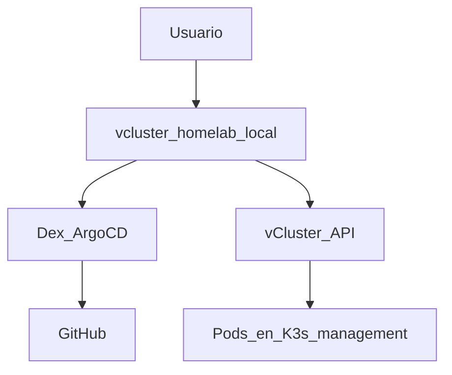

# Fase 5 — vCluster Platform (opcional)

## Objetivo

UI (interfaz de usuario) web para **clústeres virtuales** y el **management K3s (distribución ligera de Kubernetes)** (connected cluster),
con SSO (inicio de sesión único) vía Dex/GitHub y descarga de kubeconfig desde el navegador.

## Qué aprendes

Un **vCluster** expone una API (Application Programming Interface) Kubernetes aislada sin levantar VMs (máquinas virtuales) Incus;
[vCluster Platform](https://www.vcluster.com/docs/platform/) añade UI, SSO y
kubeconfig desde el navegador.

## Stack de esta fase



- **[vCluster Platform](https://www.vcluster.com/docs/platform/)** — UI + control plane virtual; Fase 5.
- **[Dex](https://dexidp.io/docs/)** — IdP OIDC (OpenID Connect); configurado en Fase 4.
- **[Ingress NGINX](https://kubernetes.github.io/ingress-nginx/)** — Expone Platform en LAN (red local).

Profundización: [vCluster Platform](../vcluster/index.md)

## Antes de empezar

- [ ] [Fase 4 — GitOps](fase-4-gitops.md) completada (Ingress, Dex, OAuth 1Password).
- [ ] `/etc/hosts` con `vcluster.homelab.local`.

## Ejecutar

```bash
kubectl apply -f gitops/argocd/apps/vcluster-platform.yaml
```

Argo CD UI → Application `vcluster-platform` → **Sync**.

Secretos OAuth (si no en 4.7): [`argocd/secrets/1password.md`](https://github.com/symintel/gitops/blob/main/argocd/secrets/1password.md).

Tras sync de `vcluster-platform`, aplica `VCLUSTER_CLIENT_SECRET` en Helm:

```bash
cd ansible
ansible-playbook -i inventory.ini playbook-dex-oauth-secrets.yml \
  --tags vcluster -e dex_oauth.apply_vcluster=true
```

## Opciones

| Decisión | Default HomeLab |
|---|---|
| Sync ArgoCD | Manual (comentada en `homelab-root`) |
| Login admin | `auth.password.disabled: false` hasta validar SSO GitHub |
| Permisos usuarios SSO | **Denegar por defecto** — sin Cluster Access / proyecto asignado no ven clústeres ni kubeconfig |

<div class="card">
  <div class="card-kicker">Análisis de trade-offs</div>
  <div class="option-grid">
    <div class="card-col">
      <div class="card-title">Sync manual</div>
      <div class="text-muted">Evita borrado accidental de Platform</div>
      <div class="text-muted">Paso extra en Argo CD</div>
    </div>
    <div class="card-col">
      <div class="card-title">Admin password habilitado</div>
      <div class="text-muted">Acceso de rescate sin GitHub</div>
      <div class="text-muted">Superficie de ataque si no se deshabilita tras SSO</div>
    </div>
    <div class="card-col">
      <div class="card-title">Solo SSO GitHub</div>
      <div class="text-muted">Un solo IdP; alineado con Dex</div>
      <div class="text-muted">Sin login si Dex/GitHub caen</div>
    </div>
    <div class="card-col">
      <div class="card-title">Kubeconfig web (Platform)</div>
      <div class="text-muted">Sin <code>scp</code>; permisos centralizados</div>
      <div class="text-muted">Requiere asignar Cluster Access explícitamente</div>
    </div>
    <div class="card-col">
      <div class="card-title">CLI (<code>vcluster connect</code>)</div>
      <div class="text-muted">Automatizable en scripts</div>
      <div class="text-muted">Sin SSO integrado en el flujo</div>
    </div>
  </div>
</div>

## Permisos: denegar por defecto

[vCluster Platform](https://www.vcluster.com/docs/platform/administer/users-permissions/overview)
no concede acceso a clústeres conectados ni vclusters solo por iniciar sesión.
Un usuario SSO nuevo **no ve recursos** hasta que un admin le asigne:

- **Cluster Access** — kubeconfig del management K3s (connected cluster)
- **Proyecto + rol** — crear/gestionar vclusters dentro de un proyecto
- **Management Role** — operaciones de plataforma (solo admins)

Pasos típicos para el primer operador (como admin de Platform):

1. **Clusters** → **Cluster Access** → Create → usuario/equipo + ClusterRole
2. Para vclusters: asignar al usuario a un **Project** con rol adecuado
3. Los equipos de GitHub llegan como grupos `loft-*` (OIDC)

## Verificar

```bash
kubectl get pods -n vcluster-platform
curl -kI https://vcluster.homelab.local
```

1. Abre `https://vcluster.homelab.local`
2. Login with SSO (GitHub)
3. New Virtual Cluster → Download kubeconfig

## Kubeconfig del management K3s

[vCluster Platform](https://www.vcluster.com/docs/platform/) registra
automáticamente el clúster **host** (el K3s donde corre Platform) como
**connected cluster**. Desde la misma UI obtienes el kubeconfig del management
cluster, no solo el de vclusters.

1. Login SSO en `https://vcluster.homelab.local`
2. **Clusters** → selecciona el clúster host (p. ej. el nombre del contexto K3s)
3. **Connect** / **Download kubeconfig**
4. `export KUBECONFIG=~/Downloads/kubeconfig.yaml && kubectl get nodes`

Si no ves el clúster o no puedes descargar kubeconfig, asigna **Cluster Access**
al usuario o equipo en Platform. Sin esa asignación, el login SSO funciona pero
**no hay clústeres ni kubeconfig visibles** (denegar por defecto). Los grupos
OIDC de GitHub llegan con prefijo `loft-` (ver
[`platform.yaml`](https://github.com/symintel/gitops/blob/main/vcluster/values/platform.yaml)).

## Accesos web del HomeLab

| Recurso | URL | Qué obtienes |
|---|---|---|
| Management K3s | `https://vcluster.homelab.local` | Kubeconfig del host K3s (connected cluster) |
| vClusters | `https://vcluster.homelab.local` | Kubeconfig de cada clúster virtual |
| Incus cluster | `https://incus.homelab.local:8443` | UI de administración Incus (OIDC tras Fase 4) |

Alternativa CLI (interfaz de línea de comandos) para el management K3s: [`fase-4-gitops.md` 4.1](fase-4-gitops.md#41-acceso-kubectl) (`scp` / Ansible).

## Si falla

| Síntoma | Revisar |
|---|---|
| SSO loop | Secretos Dex + `playbook-dex-oauth-secrets.yml --tags vcluster` |
| PVC pending | OpenEBS/Longhorn Healthy |

## Siguiente

Opcional: **[→ Fase 6 — CAPN](fase-6-capn.md)** ·
**[Resumen del HomeLab](resumen-homelab.md)**
