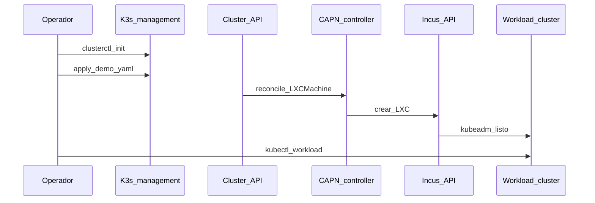

# Fase 6 — CAPN (opcional)

## Objetivo

Provisionar **workload clusters** kubeadm sobre instancias Incus vía
[Cluster API](https://cluster-api.sigs.k8s.io/) y [CAPN](https://capn.linuxcontainers.org/).

## Qué aprendes

CAPI (Cluster API) declara clusters como recursos Kubernetes; CAPN (Cluster API Provider for Incus) traduce `LXCMachine` en
instancias Incus — clusters efímeros sin tocar el management K3s (distribución ligera de Kubernetes).

!!! abstract "Aprende esta fase"
    **En simple:** Cluster API es una impresora 3D de clústeres: en vez de armar cada clúster a mano,
    escribes una descripción y el sistema lo fabrica. CAPN es el "accesorio" que usa Incus como
    fábrica: cada nodo del clúster nuevo es una instancia de Incus.

    **Conceptos clave**

    - **Management cluster y workload cluster:** el primero gestiona; el segundo es el que se crea y se usa.
    - **Provider (proveedor):** el plugin que sabe crear máquinas en una plataforma concreta (aquí, Incus).
    - **Recursos declarativos:** un clúster se describe como un objeto de Kubernetes (por ejemplo `LXCMachine`).
    - **Clústeres efímeros:** se crean para una prueba y se destruyen después.

    **Reto práctico (seguro):** genera la descripción de un clúster y léela, **sin aplicarla**. Primero exporta
    las variables que aparecen en la sección «Ejecutar» de esta fase; después:

    ```bash
    clusterctl generate cluster demo -i incus \
      --kubernetes-version v1.36.2 \
      --control-plane-machine-count 1 \
      --worker-machine-count 2 > /tmp/demo.yaml
    less /tmp/demo.yaml     # solo lectura: no ejecutes kubectl apply
    ```

    ??? question "¿Por qué crear clústeres desde un manifiesto y no a mano?"
        Se repiten igual cada vez, quedan en Git y se pueden destruir y recrear sin esfuerzo.

    ??? question "¿Qué diferencia hay entre el management cluster y un workload cluster?"
        El management cluster crea y vigila a los demás; los workload clusters ejecutan las aplicaciones.

    ¿Dudas? Usa el botón **Aprende con IA** junto a cada título, o la página [Aprende](../aprende.md).

## Stack de esta fase



- **[Cluster API](https://cluster-api.sigs.k8s.io/)** — API (Application Programming Interface) declarativa; Fase 6.
- **[CAPN](https://capn.linuxcontainers.org/)** — Provider Incus; Fase 6.
- **[clusterctl](https://cluster-api.sigs.k8s.io/user/quick-start.html)** — Bootstrap CAPI en el management cluster.
- **[Incus](https://linuxcontainers.org/incus/docs/main/)** — Runtime de instancias; Fase 2.
- **[Sealed Secrets](https://github.com/bitnami-labs/sealed-secrets)** — Credenciales Incus cifradas en git.

Profundización: [CAPN](../capn/index.md) · [Secretos](../secrets/index.md)

## Antes de empezar

- [ ] [Fase 2 — Incus](fase-2-incus.md) cluster healthy.
- [ ] [Fase 4 — GitOps](fase-4-gitops.md) con Sealed Secrets operativo.
- [ ] Credencial Incus sellada (`lxc-secret`).

La [Fase 5 — vCluster](fase-5-vcluster.md) es opcional: no hace falta para esta fase.

!!! note "Balanceador del control plane"
    Cada clúster de CAPN crea su propio balanceador para el API (`LOAD_BALANCER='lxc: {}'`, un contenedor dentro de
    Incus). Los balanceadores de red de Incus solo existen con OVN, que el HomeLab no usa: ver
    [Balanceo de carga y OVN](../incus/cluster-setup.md#balanceo-de-carga-y-ovn).

## Ejecutar

### Instalar clusterctl e init CAPN

```bash
curl -L https://github.com/kubernetes-sigs/cluster-api/releases/download/v1.10.10/clusterctl-linux-amd64 -o clusterctl
chmod +x clusterctl && sudo mv clusterctl /usr/local/bin/
mkdir -p ~/.cluster-api
curl -o ~/.cluster-api/clusterctl.yaml https://capn.linuxcontainers.org/static/v0.1/clusterctl.yaml
clusterctl init -i incus
```

### Generar y aplicar cluster demo

Ver comandos completos en [CAPN — profundización](../capn/index.md).

```bash
kubectl apply -f gitops/argocd/apps/capn-demo.yaml
# Sync manual en ArgoCD
```

## Opciones

| Decisión | Default HomeLab |
|---|---|
| Sync ArgoCD | Manual (efímero, evita borrados accidentales) |
| Target workers | `@arm64-nodes` (deborah) / CP `@x86-nodes` |

<div class="card">
  <div class="card-kicker">Análisis de trade-offs</div>
  <div class="option-grid">
    <div class="card-col">
      <div class="card-title">Sync manual</div>
      <div class="text-muted">Clusters efímeros no se prunean solos</div>
      <div class="text-muted">Apply + Sync en UI cada vez</div>
    </div>
    <div class="card-col">
      <div class="card-title">Workers en <code>@arm64-nodes</code></div>
      <div class="text-muted">Aprovecha 31 GB de deborah</div>
      <div class="text-muted">Menos margen si deborah ya es CP K3s</div>
    </div>
    <div class="card-col">
      <div class="card-title">CP en <code>@x86-nodes</code></div>
      <div class="text-muted">Separación CP workload / management</div>
      <div class="text-muted">Más RAM en nodos x86 limitados</div>
    </div>
    <div class="card-col">
      <div class="card-title">CAPN vs vCluster</div>
      <div class="text-muted">VMs/Incus reales; kubeadm completo</div>
      <div class="text-muted">Mucha más RAM que vCluster en pods</div>
    </div>
  </div>
</div>

## Verificar

```bash
kubectl get clusters
kubectl get machines
```

## Si falla

| Síntoma | Revisar |
|---|---|
| Machine stuck | Secret Incus, IP Incus en `lxc-secret` |
| Image pull | [images.linuxcontainers.org](https://images.linuxcontainers.org/) |

## Siguiente

**[→ Resumen del HomeLab](resumen-homelab.md)** · [Stack tecnológico](stack-tecnologico.md)
