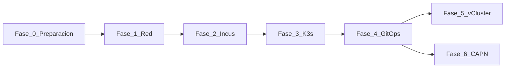

# Implementación — guía paso a paso

Esta sección es el **recorrido principal** del HomeLab: desde nodos bare-metal
hasta GitOps completo. Cada fase es ejecutable, verificable y enlaza al
[stack tecnológico](stack-tecnologico.md) y a páginas de profundización.

!!! tip "Cómo usar esta guía"
    Sigue las fases en orden la primera vez. En despliegues posteriores puedes
    saltar a la fase que necesites si los prerrequisitos ya están cumplidos.
    Donde haya **más de una alternativa**, cada fase incluye un breve
    **Análisis de trade-offs** (ventaja vs coste/riesgo).

## Timeline de fases

  

    

      
0

      

    

    

      
<a href="fase-0-preparacion/">Preparación</a> Completada

      
Repo, Ansible, inventario, discovery opcional.

      
<code>playbook-discovery.yml</code>

    

  

  

    

      
1

      

    

    

      
<a href="fase-1-red/">Red</a> Completada

      
IP fija en <code>br0</code> en los 3 nodos.

      
<code>playbook-set-static-ip.yml</code>

    

  

  

    

      
2

      

    

    

      
<a href="fase-2-incus/">Incus</a> Completada

      
Clúster Incus HA + cluster groups + UI.

      
<code>playbook-bootstrap.yml</code> + <code>playbook-incus-cluster.yml</code>

    

  

  

    

      
3

      

    

    

      
<a href="fase-3-k3s/">K3s</a> Completada

      
Management cluster + ArgoCD controller.

      
<code>playbook-k3s.yml</code>

    

  

  

    

      
4

      

    

    

      
<a href="fase-4-gitops/">GitOps</a> Completada

      
MetalLB, Ingress, storage, Dex, waves.

      
Argo CD + <code>gitops</code>

    

  

  

    

      
5

      

    

    

      
<a href="fase-5-vcluster/">vCluster</a> Opcional

      
Clústeres virtuales + kubeconfig web.

      
Application manual

    

  

  

    

      
6

    

    

      
<a href="fase-6-capn/">CAPN</a> Opcional

      
Workload clusters sobre Incus.

      
<code>clusterctl</code> + Application manual

    

  

**Cierre de la guía:** **[Resumen del HomeLab](resumen-homelab.md)** — checklist global,
URLs, `/etc/hosts`, nodos y verificación.

## Dos repos, dos responsabilidades

| Repo | Qué instala | Herramienta |
|---|---|---|
| [`homelab`](https://github.com/symintel/homelab) | Red SO, Incus, K3s, kube-vip, controller ArgoCD | [Ansible](https://docs.ansible.com/) |
| [`gitops`](https://github.com/symintel/gitops) | MetalLB, Ingress, storage, vCluster, CAPN, … | [Argo CD](https://argo-cd.readthedocs.io/) |

## Stack tecnológico

Diagrama por capas, lista de productos con enlaces oficiales y rol en el HomeLab:

**[Ver stack tecnológico completo →](stack-tecnologico.md)**

Vista arquitectónica complementaria: [Arquitectura C4](../architecture/overview.md).

## Mapa de decisiones (forks)

| Decisión | Opción A (default HomeLab) | Opción B |
|---|---|---|
| API K3s estable | IP fija deborah (`192.168.20.5`) | [kube-vip](https://kube-vip.io/) (`kube_vip.enabled: true` en `k3s_install.yml`) |
| Instalar K3s | `playbook-k3s.yml` | curl manual ([referencia](../k3s/index.md)) |
| **CNI** | [Flannel](https://github.com/flannel-io/flannel) embebido (`vxlan`) | [Canal](https://docs.tigera.io/calico/latest/getting-started/kubernetes/flannel/flannel), [Calico](https://docs.tigera.io/calico/latest/about/), [Cilium](https://docs.cilium.io/) |
| Secretos OAuth | [1Password SDK](https://github.com/1Password/onepassword-sdk-python) — cuenta personal, bóveda `HomeLab` | Cuenta empresa u otra bóveda vía env vars |
| vCluster / CAPN | Comentadas en `homelab-root` | Descomentar en `root-appset.yaml` cuando estés listo |
| Storage HA | [Longhorn](https://longhorn.io/docs/) en invincible+deborah | Solo [OpenEBS](https://openebs.io/docs) |

  
Análisis de trade-offs

  

    

      
IP fija vs kube-vip

      
IP fija: cero componentes extra

      
kube-vip: VIP <code>192.168.20.4</code> estable si el CP cambia de nodo

    

    

      
kube-vip

      
API en IP dedicada; agents no dependen de hostname

      
Un daemon más; no sustituye MetalLB

    

    

      
Ansible vs curl K3s

      
Idempotente, flags en <code>group_vars</code>

      
Manual solo para depuración puntual

    

    

      
Flannel elegida

      
Embebido en K3s; bajo consumo

      
Sin NetworkPolicy nativa

    

    

      
Canal / Calico / Cilium

      
Políticas de red (Canal/Calico) o eBPF (Cilium)

      
<code>--flannel-backend=none</code>; más RAM/CPU; elegir <strong>antes</strong> del bootstrap

    

    

      
1Password SDK

      
Secretos fuera de git; DesktopAuth local

      
Requiere app 1Password desbloqueada en la estación

    

    

      
env vars / <code>kubectl patch</code>

      
Sin 1Password

      
Secretos en shell/historial; no idempotente

    

    

      
Sync manual vCluster/CAPN

      
Evita borrados accidentales de clusters efímeros

      
Paso extra en Argo CD UI

    

    

      
Longhorn

      
Replicación x86↔arm64

      
Solo 2 nodos; más pods que OpenEBS

    

    

      
Solo OpenEBS

      
LocalPV en 3 nodos; simple

      
Sin HA entre nodos

    

  

Detalle CNI (Container Network Interface): [Fase 3 — K3s](fase-3-k3s.md#opciones) · [playbook-options](../k3s/playbook-options.md#cni).

Detalle de flags K3s (distribución ligera de Kubernetes): [Opciones del playbook](../k3s/playbook-options.md).

Catálogo de roles Ansible: [Ansible — roles](../ansible/index.md).

## Empieza aquí

**[→ Fase 0 — Preparación](fase-0-preparacion.md)**

Apéndice fuera del flujo feliz: [Desinstalar K3s](apendice-desinstalar.md).
