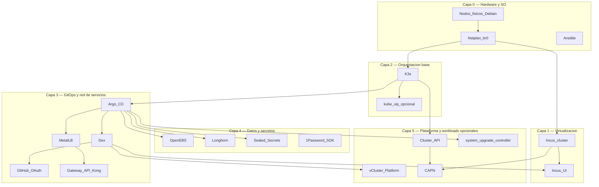

# Stack tecnológico

Inventario de tecnologías del HomeLab: **diagrama por capas** + lista con
enlaces oficiales en el nombre de cada producto.

Parte de la [guía de implementación](index.md). Vista C4 (modelo C4) complementaria:
[Arquitectura](../architecture/overview.md) · [Nivel 3 — Componentes](../architecture/nivel-3-componentes.md) · [Nivel 4 — Despliegue](../architecture/nivel-4-despliegue.md).

## Diagrama por capas

## Capa 0 — Bootstrap

- **[Ansible](https://docs.ansible.com/)** — Automatización idempotente de SO, red, Incus y K3s (distribución ligera de Kubernetes); Fases 0–3.
- **[Netplan](https://netplan.io/)** — IP estática en `br0`; Fase 1; identidad de nodo para Incus/K3s/CAPN.
- **[Debian](https://www.debian.org/)** — SO base en los 3 nodos; prerequisito global.

## Capa 1 — Virtualización

- **[Incus](https://linuxcontainers.org/incus/docs/main/)** — Clúster LXC/VM con quorum; Fase 2; sustrato para CAPN (Cluster API Provider for Incus) e instancias.
- **[Incus UI](https://linuxcontainers.org/incus/docs/main/howto/server_expose/#web-ui)** — Administración web del clúster Incus; Fase 2 (cert) + Fase 4 (OIDC Dex).
- **[Zabbly Incus stable](https://github.com/zabbly/incus-stable)** — Repo de paquetes; Fase 2.

## Capa 2 — Kubernetes management

- **[K3s](https://docs.k3s.io/)** — Management cluster bare-metal; Fase 3.
- **[kube-vip](https://kube-vip.io/)** — VIP (IP virtual) opcional del API (Application Programming Interface) `:6443`; Fase 3 (fork).
- **CNI (elegir uno)** — Fase 3:
  - **[Flannel](https://github.com/flannel-io/flannel)** — default embebido en K3s (`vxlan` en `br0`)
  - **[Canal](https://docs.tigera.io/calico/latest/getting-started/kubernetes/flannel/flannel)** — Flannel + políticas Calico
  - **[Calico](https://docs.tigera.io/calico/latest/about/)** — NetworkPolicy, BGP (Border Gateway Protocol) opcional
  - **[Cilium](https://docs.cilium.io/)** — eBPF, Hubble, políticas L3–L7

  
CNI

  

    

      
Flannel

      
Cero pasos extra en K3s

      
Sin NetworkPolicy nativa

    

    

      
Canal

      
Políticas sobre overlay conocido

      
Legacy; dos stacks

    

    

      
Calico

      
Madurez y BGP en L2

      
Más pods/RAM

    

    

      
Cilium

      
Observabilidad eBPF

      
CPU/kernel; validar ARM64

    

  

## Capa 3 — GitOps, red y acceso

- **[Argo CD](https://argo-cd.readthedocs.io/)** — ApplicationSet de bootstrap (`homelab-root`) desde GitHub, por olas; Fase 4.
- **[Dex](https://dexidp.io/docs/)** — IdP OIDC (OpenID Connect) embebido en ArgoCD; SSO (inicio de sesión único) para ArgoCD, vCluster Platform e Incus UI (interfaz de usuario); Fase 4.
- **[GitHub](https://docs.github.com/en/apps/oauth-apps)** — Connector OAuth + repos GitOps; Fase 4.
- **[MetalLB](https://metallb.universe.tf/)** — LoadBalancer en LAN (red local); Fase 4 wave 0–1.
- **[Gateway API](https://gateway-api.sigs.k8s.io/)** con **[Kong Ingress Controller](https://developer.konghq.com/kubernetes-ingress-controller/)** — HTTP(S) hacia ArgoCD y vCluster; Fase 4 wave 1 (alternativas: Traefik, NGINX Gateway Fabric).
- **[1Password Python SDK](https://github.com/1Password/onepassword-sdk-python)** — Secretos OAuth desde la app local; Fase 4.

## Capa 4 — Storage y secretos en clúster

- **[OpenEBS](https://openebs.io/docs)** — LocalPV default; Fase 4 wave 0.
- **[Longhorn](https://longhorn.io/docs/)** — Storage replicado cross-arch; Fase 4 wave 1.
- **[Sealed Secrets](https://github.com/bitnami-labs/sealed-secrets)** — Secretos cifrados en git; Fase 4 y 6.
- **[SOPS](https://github.com/getsops/sops)** — Cifrado pre-bootstrap; profundización [Secretos](../secrets/index.md).

## Capa 5 — Opcionales y operaciones

- **[vCluster Platform](https://www.vcluster.com/docs/platform/)** — Clústeres virtuales + kubeconfig web (host K3s y vclusters); Fase 5.
- **[Cluster API](https://cluster-api.sigs.k8s.io/)** — API declarativa de clusters; Fase 6.
- **[CAPN](https://capn.linuxcontainers.org/)** — Provider Incus para CAPI (Cluster API); Fase 6.
- **[clusterctl](https://cluster-api.sigs.k8s.io/user/quick-start.html)** — CLI (interfaz de línea de comandos) bootstrap CAPI; Fase 6.
- **[system-upgrade-controller](https://github.com/rancher/system-upgrade-controller)** — Upgrades K3s escalonados; Fase 4 wave 3.
