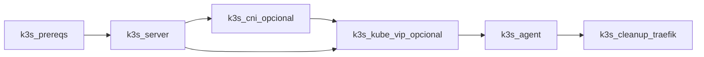
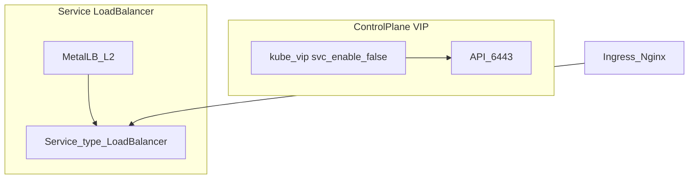

# Opciones del playbook K3s (bootstrap)

Anexo de **[Fase 3 — K3s](../implementacion/fase-3-k3s.md)**.

El playbook [`playbook-k3s.yml`](https://github.com/symintel/homelab/blob/main/ansible/playbook-k3s.yml) instala **solo
lo que ArgoCD no puede hacer**: binario K3s (distribución ligera de Kubernetes), kube-vip CP (control plane), controller ArgoCD,
etiquetas de nodos, etc. Addons (MetalLB, Ingress, Longhorn, vCluster, …) van
en el repo [`gitops`](https://github.com/symintel/gitops).

Configuración: [`ansible/group_vars/incus_cluster/k3s_install.yml`](https://github.com/symintel/homelab/blob/main/ansible/group_vars/incus_cluster/k3s_install.yml)

Catálogo de roles: [Ansible — roles](../ansible/index.md)

```bash
cd ansible
ansible-playbook -i inventory.ini playbook-k3s.yml
```

## Tabla A — Opciones del playbook

| Opción | Variable | Tag | Default | Cuándo activar |
|---|---|---|---|---|
| Core K3s | `k3s_install.core.*` | `core` | HomeLab actual | Siempre (server/agent) |
| kube-vip CP | `k3s_install.kube_vip.enabled` | `kube_vip` | `false` | VIP estable en `:6443`; **sin** Service LB |
| ArgoCD controller | `k3s_install.gitops_argocd.enabled` | `argocd` | `false` | Bootstrap GitOps; apps en gitops |
| Node labels | `k3s_install.node_labels.enabled` | `labels` | `false` | Etiquetas Longhorn/arch/tier vía `host_vars` |
| Traefik cleanup | `k3s_install.traefik_cleanup.enabled` | `traefik` | `true` | Tras install con `--disable traefik` |
| Fetch kubeconfig | `k3s_install.fetch_kubeconfig.enabled` | `kubeconfig` | `false` | Copiar kubeconfig al operador |
| OS hardening | `k3s_install.os_hardening.enabled` | `hardening` | `false` | `unattended-upgrades` escalonado |
| CNI externo | `k3s_install.core.cni` | `cni` | `flannel` | Canal, Calico o Cilium (no Flannel embebido) |

<div class="card">
  <div class="card-kicker">Tabla A</div>
  <div class="option-grid">
    <div class="card-col">
      <div class="card-title">kube-vip</div>
      <div class="text-muted">VIP API sin depender de IP del nodo CP</div>
      <div class="text-muted">No reemplaza MetalLB</div>
    </div>
    <div class="card-col">
      <div class="card-title">ArgoCD en Ansible</div>
      <div class="text-muted">Controller listo antes de Fase 4</div>
      <div class="text-muted">Más tiempo en Fase 3</div>
    </div>
    <div class="card-col">
      <div class="card-title">Traefik cleanup</div>
      <div class="text-muted">Evita conflicto con Ingress NGINX</div>
      <div class="text-muted">Play extra tras agents</div>
    </div>
    <div class="card-col">
      <div class="card-title">fetch_kubeconfig</div>
      <div class="text-muted">Kubeconfig en la estación</div>
      <div class="text-muted">Archivo local con credenciales</div>
    </div>
    <div class="card-col">
      <div class="card-title">OS hardening</div>
      <div class="text-muted">Parches automáticos escalonados</div>
      <div class="text-muted">Reboots programados</div>
    </div>
    <div class="card-col">
      <div class="card-title">CNI externo</div>
      <div class="text-muted">NetworkPolicy (Calico/Cilium) o Canal</div>
      <div class="text-muted">Requiere <code>--flannel-backend=none</code>; play <code>cni</code> antes de agents</div>
    </div>
  </div>
</div>

### Core (`k3s_install.core`)

| Campo | Default | Descripción |
|---|---|---|
| `version` | `v1.36.2+k3s1` | Versión K3s |
| `disable_components` | traefik, servicelb | `--disable` en server |
| `cluster_cidr` | `10.42.0.0/16` | Pod CIDR |
| `service_cidr` | `10.43.0.0/16` | Service CIDR |
| `cni` | `flannel` | `flannel`, `canal`, `calico`, `cilium` |
| `flannel_backend` | `vxlan` | Solo si `cni: flannel`: `vxlan`, `host-gw`, `wireguard-native` |
| `embedded_registry` | `false` | Cache local de imágenes (`--embedded-registry`) |
| `tls_sans_extra` | `[]` | SANs adicionales en certificado API |

## CNI

K3s trae **Flannel** embebido. Canal, Calico y Cilium requieren
`--flannel-backend=none` y `--disable-network-policy` (rol [`k3s_cni`](https://github.com/symintel/homelab/blob/main/ansible/roles/k3s_cni/README.md),
tag `cni`, **después** del server y **antes** de los agents).

| CNI | `k3s_install.core.cni` | Instalación |
|---|---|---|
| [Flannel](https://github.com/flannel-io/flannel) | `flannel` (default) | Embebido; ajusta `flannel_backend` |
| [Canal](https://docs.tigera.io/calico/latest/getting-started/kubernetes/flannel/flannel) | `canal` | Manifest Canal (Ansible o Application `canal`) |
| [Calico](https://docs.tigera.io/calico/latest/about/) | `calico` | Tigera operator + custom resources |
| [Cilium](https://docs.cilium.io/) | `cilium` | Helm chart oficial |

Activalo editando [`group_vars/incus_cluster/k3s_install.yml`](https://github.com/symintel/homelab/blob/main/ansible/group_vars/incus_cluster/k3s_install.yml)
(`core.cni: calico`, `gitops_argocd.enabled: true`) y después:

```bash
ansible-playbook -i inventory.ini playbook-k3s.yml
```

!!! warning "`-e k3s_install.x.y=valor` no funciona"
    Ansible no fusiona claves con puntos contra un dict existente — crea una
    variable nueva separada (literalmente llamada `"k3s_install.x.y"`) y
    `k3s_install` queda sin tocar. Un `-e` con JSON tampoco sirve: **reemplaza**
    el dict entero en vez de fusionarlo, así que perdés `core.version`,
    `cluster_cidr`, etc. Para togglear estas opciones, editá el archivo.

Alternativa GitOps (sync manual): Applications `calico-operator` + `calico-config`,
`canal` o `cilium` en [`gitops/argocd/apps/`](https://github.com/symintel/gitops/tree/main/argocd/apps) —
solo si instalaste K3s con `cni` distinto de `flannel` vía Ansible **o** aplicas el
manifest tras `--flannel-backend=none`. **No** actives más de una app CNI (Container Network Interface) a la vez.

### Análisis de trade-offs — CNI

| CNI | Ventaja | Coste / riesgo |
|---|---|---|
| Flannel | Cero pasos extra; bajo consumo | Sin NetworkPolicy nativa |
| Canal | Políticas Calico sobre Flannel | Legacy; dos componentes |
| Calico | NetworkPolicy madura; BGP opcional | Más pods/RAM |
| Cilium | eBPF; Hubble; políticas L3–L7 | CPU/kernel; validar ARM64 |
| `vxlan` vs `host-gw` | `host-gw`: menos encapsulación en L2 | `host-gw` exige L2 directo entre nodos |
| Ansible `k3s_cni` vs GitOps app | Mismo play que K3s bootstrap | GitOps útil si reinstalas CNI sin Ansible |

### Orden de ejecución (playbook)



El play `cni` se omite si `k3s_install.core.cni` es `flannel` (default).

### kube-vip

Solo VIP (IP virtual) del **control-plane** (`cp_enable=true`, `svc_enable=false`). No
sustituye MetalLB ni ServiceLB de K3s.

| Campo | Default | Descripción |
|---|---|---|
| `address` | `192.168.20.4` | IP libre en LAN |
| `interface` | `br0` | Interfaz L2 |
| `mode` | `arp` | `arp` o `bgp` |

### Análisis de trade-offs — kube-vip

| Alternativa | Ventaja | Coste / riesgo |
|---|---|---|
| `arp` | Simple en LAN L2 HomeLab | Depende de respuesta ARP del router |
| `bgp` | Integración con router BGP | Requiere router/peering configurado |

Con `kube_vip.enabled=true`, `k3s_api_url` apunta a la VIP y los agents se
unen por ella.

### Per-host (`host_vars/`)

```yaml
k3s_agent_kubelet_args:
  - max-pods=110
k3s_node_labels:
  workload-tier: light
  node.longhorn.io/create-default-disk: "false"
```

## Tabla B — gitops (no playbook)

Catálogo completo y guía paso a paso en [Fase 4 — GitOps](../implementacion/fase-4-gitops.md).

| Componente | Application | Sync |
|---|---|---|
| Sealed Secrets | `sealed-secrets` | auto (wave 0) |
| OpenEBS | `openebs` | auto (wave 0) |
| StorageClasses | `homelab-storage` | auto (wave 0) |
| MetalLB | `metallb` + `metallb-config` | auto |
| Ingress-Nginx | `ingress-nginx` | auto (wave 1) |
| Longhorn | `longhorn` | auto (wave 1) |
| ArgoCD Dex/ingress | `argocd-ingress`, `argocd-config` | auto (wave 2) |
| K3s upgrades | `k3s-upgrade` | auto (wave 3) |
| vCluster Platform | `vcluster-platform` | manual |
| CAPN demo | `capn-demo` | manual |
| CNI (opcional) | `calico-operator`, `calico-config`, `canal`, `cilium` | manual |

### Análisis de trade-offs — kube-vip vs MetalLB

| Alternativa | Ventaja | Coste / riesgo |
|---|---|---|
| kube-vip | VIP estable solo para API `:6443` | No expone Ingress ni Services |
| MetalLB | LoadBalancer para Ingress y apps | Pool `192.168.23.200–.220` debe estar libre (fuera del DHCP) |
| CNI vía Ansible (`k3s_cni`) | Mismo play que bootstrap K3s | Cambiar CNI en vivo es disruptivo |
| CNI vía GitOps (apps manuales) | Reinstalar sin Ansible | Solo si K3s ya tiene `flannel-backend=none` |

## Después del playbook Ansible

Continúa en [Fase 4 — GitOps](../implementacion/fase-4-gitops.md).

## Playbook OAuth Dex (Fase 4)

[`playbook-dex-oauth-secrets.yml`](https://github.com/symintel/homelab/blob/main/ansible/playbook-dex-oauth-secrets.yml) —
genera `INCUS_CLIENT_SECRET` y `VCLUSTER_CLIENT_SECRET` en 1Password si faltan,
aplica `argocd-secret` y opcionalmente configura Incus OIDC (OpenID Connect) en invincible.

```bash
cd ansible
ansible-playbook -i inventory.ini playbook-dex-oauth-secrets.yml
ansible-playbook -i inventory.ini playbook-dex-oauth-secrets.yml --tags incus,incus_auth \
  -e dex_oauth.apply_incus=true -e dex_oauth.configure_incus_auth=true
ansible-playbook -i inventory.ini playbook-dex-oauth-secrets.yml --tags vcluster \
  -e dex_oauth.apply_vcluster=true
```

Variables: [`group_vars/dex_oauth_secrets.yml`](https://github.com/symintel/homelab/blob/main/ansible/group_vars/dex_oauth_secrets.yml).

## Ejemplos

```bash
# Mínimo (con los defaults de group_vars/incus_cluster/k3s_install.yml)
ansible-playbook -i inventory.ini playbook-k3s.yml

# Solo un play puntual (ej. reintentar kube-vip), con las opciones ya
# habilitadas en group_vars/incus_cluster/k3s_install.yml:
ansible-playbook -i inventory.ini playbook-k3s.yml --tags kube_vip

# Post-install GitOps
kubectl apply -f gitops/bootstrap/root-appset.yaml
```

Para VIP + ArgoCD controller: habilitá `kube_vip.enabled: true` y
`gitops_argocd.enabled: true` en `group_vars/incus_cluster/k3s_install.yml`
antes de correr el playbook (ver el warning arriba sobre por qué `-e` no
sirve para esto).

## kube-vip vs MetalLB



kube-vip **nunca** debe gestionar Services `LoadBalancer` (`svc_enable=false`).

## Playbook clúster Incus (Fase 2)

[`playbook-incus-cluster.yml`](https://github.com/symintel/homelab/blob/main/ansible/playbook-incus-cluster.yml) — bootstrap,
join, cluster groups, scheduler manual y UI (interfaz de usuario). Ejecutar tras `playbook-bootstrap.yml`.

```bash
cd ansible
ansible-playbook -i inventory.ini playbook-incus-cluster.yml
```

| Tag | Qué hace |
|---|---|
| `bootstrap` | Preseed init en invincible |
| `join` | Tokens + join oliver/deborah (`serial: 1`) |
| `groups` | `x86-nodes`, `arm64-nodes`, asignaciones |
| `scheduler` | `oliver` → `scheduler.instance manual` |
| `ui` | `incus-ui-canonical` + `core.https_address` |

Variables: [`group_vars/incus_cluster/vars.yml`](https://github.com/symintel/homelab/blob/main/ansible/group_vars/incus_cluster/vars.yml).
Guía: [Fase 2 — Incus](../implementacion/fase-2-incus.md).
