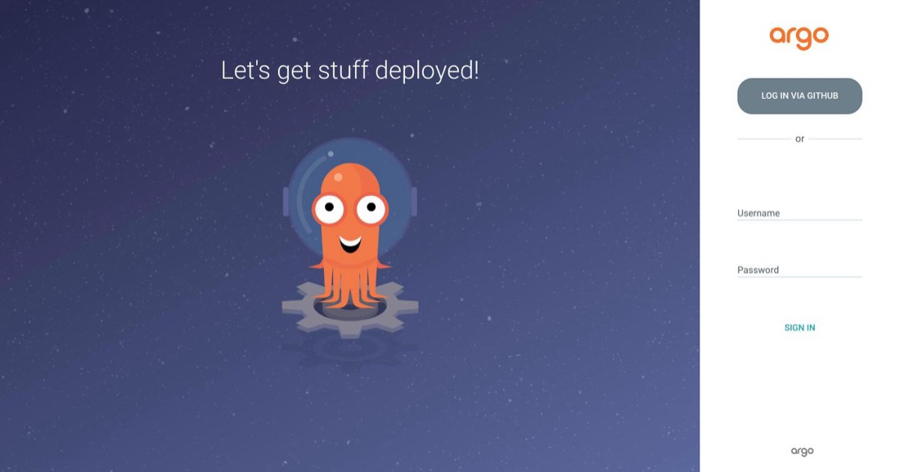
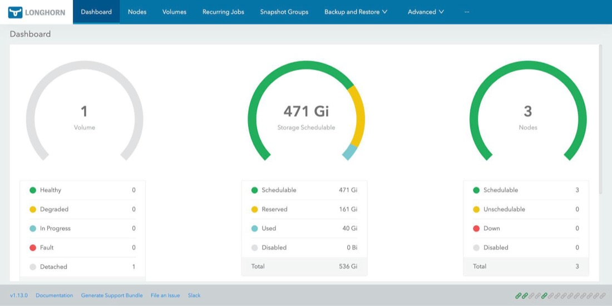

# URLs y accesos de los productos

Dónde está cada herramienta del HomeLab, cómo se entra y con qué credenciales. Todas las direcciones `*.homelab.local` solo
resuelven **dentro de la LAN**, porque las sirve el DNS (sistema de nombres de dominio) del propio HomeLab: BIND en `deborah`, `192.168.20.5`.
Si tu equipo no usa ese DNS, agrega las entradas a tu archivo `hosts` (ver [Resumen del HomeLab](../implementacion/resumen-homelab.md)).

<div class="card">
  <div class="card-kicker">Accesos principales</div>
  <div class="option-grid">
    <div class="card-col">
      <div class="card-title">Argo CD</div>
      <div class="text-muted">GitOps · inicio de sesión con GitHub</div>
      <div class="text-muted"><a href="https://argocd.homelab.local">argocd.homelab.local</a></div>
    </div>
    <div class="card-col">
      <div class="card-title">Incus UI</div>
      <div class="text-muted">Instancias, redes y balanceadores · SSO o TLS</div>
      <div class="text-muted"><a href="https://incus.homelab.local:8443/ui/">incus.homelab.local:8443</a></div>
    </div>
    <div class="card-col">
      <div class="card-title">Longhorn <span class="tag">Por túnel</span></div>
      <div class="text-muted">Almacenamiento replicado · sin login</div>
      <div class="text-muted"><code>kubectl port-forward</code> → <code>127.0.0.1:8080</code></div>
    </div>
    <div class="card-col">
      <div class="card-title">Documentación</div>
      <div class="text-muted">Esta guía</div>
      <div class="text-muted"><a href="https://homelab.symintelligent.com">homelab.symintelligent.com</a></div>
    </div>
  </div>
</div>

## Resumen

| Producto | Dirección | Acceso |
|---|---|---|
| **Argo CD** (GitOps) | [`https://argocd.homelab.local`](https://argocd.homelab.local) | GitHub, con SSO (inicio de sesión único) a través de Dex |
| **Dex** (SSO) | [`https://argocd.homelab.local/api/dex`](https://argocd.homelab.local/api/dex/.well-known/openid-configuration) (emisor OIDC) | Sin interfaz propia: lo usan Argo CD, Incus UI y vCluster |
| **Incus UI** | [`https://incus.homelab.local:8443/ui/`](https://incus.homelab.local:8443/ui/) | SSO (GitHub, vía Dex) o certificado TLS |
| **Longhorn UI** | No está publicada: `kubectl port-forward` y `http://127.0.0.1:8080` | Sin login |
| **vCluster Platform** | [`https://vcluster.homelab.local`](https://vcluster.homelab.local) | SSO (vía Dex). Se activa en la Fase 5; sin ella la URL responde 404 |
| **Documentación** | [`https://homelab.symintelligent.com`](https://homelab.symintelligent.com) | Pública |
| **API de Kubernetes** | `https://192.168.20.5:6443` (`deborah`) | `kubeconfig` |
| **Gateway** (Kong) | `192.168.23.200` | — (recibe el tráfico de todos los `*.homelab.local`) |
| **DNS** (BIND) | `192.168.20.5` | — (zonas `homelab.local` y `mco.local`) |

!!! note "Cualquier `*.homelab.local` llega al Gateway"
    La zona `homelab.local` apunta `argocd` y `vcluster` a la IP del Gateway (`192.168.23.200`) y `incus` al líder del clúster
    (`invincible`, `192.168.20.6`). Cualquier otro nombre `*.homelab.local` cae también en el Gateway, para que una `HTTPRoute`
    nueva funcione sin tocar el DNS. Solo existe la ruta de Argo CD; por eso `vcluster.homelab.local` resuelve pero responde 404.

## Argo CD

La interfaz de GitOps. Pide iniciar sesión con GitHub (Dex); solo entran los miembros del team `devops` de la organización `symintel`.

??? note "Ver captura: inicio de sesión de Argo CD"
    { loading=lazy }

Dentro, la aplicación raíz `homelab-root` agrupa todas las demás (vista de árbol):

??? note "Ver captura: árbol de homelab-root"
    { loading=lazy }

Más sobre el catálogo y los problemas frecuentes: [GitOps — catálogo y troubleshooting](../gitops/index.md).

## Incus UI

La interfaz web del clúster de Incus. Está en el nodo `invincible` (el líder), puerto `8443`; cada nodo expone además su propia API en
ese puerto. Ofrece dos formas de entrar:

??? note "Ver captura: acceso a Incus UI"
    { loading=lazy }

- **Login with SSO:** GitHub a través de Dex (OIDC, estándar de inicio de sesión). Ver [Clúster Incus — OIDC vía Dex](../incus/cluster-setup.md#oidc-via-dex-fase-4).
- **Login with TLS:** con un certificado de cliente instalado en el navegador.

Los balanceadores de red están en **Networks → `ovn-lan` → pestaña «Load balancers»** (ver [Balanceo de carga y OVN](../incus/cluster-setup.md#balanceo-de-carga-y-ovn)).

## Longhorn UI

El almacenamiento replicado tiene su propio panel, **sin pantalla de login y sin ruta en el Gateway**: es un Service interno. Se abre con un
túnel temporal desde tu equipo:

```bash
export KUBECONFIG=~/.kube/homelab-k3s.yaml
kubectl -n longhorn-system port-forward svc/longhorn-frontend 8080:80
# y abre http://127.0.0.1:8080  (Ctrl+C para cerrar el túnel)
```

??? note "Ver captura: panel de Longhorn"
    { loading=lazy }

Más sobre las clases de almacenamiento: [Storage](../storage/index.md#actualizar-y-reinstalar-longhorn).

## vCluster Platform

Su dirección es `https://vcluster.homelab.local`, pero **no se despliega por defecto**: su Application está comentada en
`gitops/bootstrap/root-appset.yaml` y no hay `HTTPRoute`, así que hasta activarla en la [Fase 5](../implementacion/fase-5-vcluster.md) la URL responde 404.

## Sin interfaz propia

Estas piezas no tienen UI; se revisan con `kubectl` o con Argo CD:

| Producto | Cómo mirarlo |
|---|---|
| **MetalLB** (IP de los `LoadBalancer`) | `kubectl get ipaddresspool,l2advertisement -n metallb-system`; pool `192.168.23.200–.220` |
| **Calico** (red de los pods) | `kubectl get tigerastatus` y `kubectl get installation default` |
| **Kong** (Gateway) | `kubectl get gateway,httproute -A` |
| **cert-manager** (certificados) | `kubectl get clusterissuer,certificate -A` |
| **OVN** (red virtual de Incus) | `incus network list` y `ovn-nbctl lb-list` en un nodo |
| **ARC** (runners de GitHub Actions) | `kubectl get pods -n arc-runners` |

## Otros enlaces

| Qué | Dónde |
|---|---|
| Código (Ansible, OpenTofu, documentación) | [`symintel/homelab`](https://github.com/symintel/homelab) |
| Manifiestos GitOps | [`symintel/gitops`](https://github.com/symintel/gitops) |
| Pipelines reutilizables | [`symintel/core-pipelines`](https://github.com/symintel/core-pipelines) |
| Documentación completa en texto plano (para IA) | [`llms-full.txt`](https://homelab.symintelligent.com/llms-full.txt) |
| Cuaderno de estudio con IA | [Aprende con IA](../aprende.md) |

## Comprobar que responden

```bash
for u in https://argocd.homelab.local/ https://incus.homelab.local:8443/ui/; do
  echo "$u -> $(curl -sk -o /dev/null -w '%{http_code}' --max-time 6 $u)"
done
dig @192.168.20.5 argocd.homelab.local +short     # debe dar 192.168.23.200
```

Si una URL no abre, empieza por el DNS (`dig`) y por el Gateway (`curl -k https://192.168.23.200`); la tabla de
[resolución de problemas de GitOps](../gitops/index.md#resolucion-de-problemas-rapida) cubre los casos más comunes.
