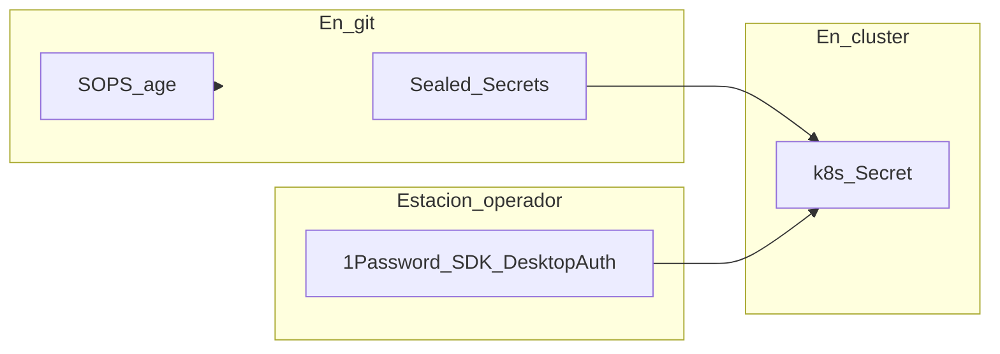

# Gestión de Secretos

!!! info "Parte de la guía de implementación"
    - **[Sealed Secrets](https://github.com/bitnami-labs/sealed-secrets)** — Fase 4 wave 0; CAPN (Cluster API Provider for Incus) Fase 6.
    - **OAuth Dex** — [Fase 4 paso 4.7](../implementacion/fase-4-gitops.md#47-secretos-oauth-github-vcluster-incus-ui).
    - **Plataforma symintel** (Apps de ArgoCD, ARC y OpenTofu, FTP) — [1Password → clúster](../symintel/github.md#paso-3-cluster-y-secretos-de-plataforma).

## Diagrama — tres vías de secretos



## Sealed Secrets (default en clúster)

[Sealed Secrets](https://github.com/bitnami-labs/sealed-secrets) — un controller
(~20–30 MB RAM), sin cuenta externa.

```bash
kubeseal --format yaml < secret-plano.yaml > secret-sellado.yaml
kubectl apply -f secret-sellado.yaml
rm secret-plano.yaml
```

## SOPS + age (complemento, cero pods)

[SOPS](https://github.com/getsops/sops) — config pre-bootstrap (tokens Incus, etc.).

```bash
age-keygen -o key.txt
sops --encrypt --age <public-key> secrets.yaml > secrets.enc.yaml
```

## OAuth Dex (GitHub + vCluster + Incus UI) — 1Password SDK local

Credenciales de **GitHub OAuth App** y clientes Dex **vCluster Platform** e
**Incus UI (interfaz de usuario)** no van en git.

| Origen | Campos |
|---|---|
| **GitHub** (OAuth App de la org `symintel`) | `GITHUB_CLIENT_ID`, `GITHUB_CLIENT_SECRET` |
| **Ansible** (`playbook-dex-oauth-secrets.yml`) | `VCLUSTER_CLIENT_SECRET`, `INCUS_CLIENT_SECRET` (genera en 1Password si faltan; aplica en Dex, Incus y/o Helm) |

`INCUS_CLIENT_SECRET` **no** se crea en GitHub. Ansible lo genera en 1Password
si falta y lo aplica en Dex e Incus.

Se leen con el **[1Password Python SDK](https://github.com/1Password/onepassword-sdk-python)**
y **DesktopAuth** en la estación donde la app 1Password está desbloqueada.

Por defecto: **cuenta personal** (`ONEPASSWORD_ACCOUNT_NAME=Personal`), bóveda
**`HomeLab`**, un ítem con campos `GITHUB_CLIENT_ID`, `GITHUB_CLIENT_SECRET`,
`VCLUSTER_CLIENT_SECRET`, `INCUS_CLIENT_SECRET`. Probar: `ansible/scripts/test-1password.py`.

Homepage `https://argocd.homelab.local` (informativa); Redirect URIs
`https://argocd.homelab.local/api/dex/callback` (crítico).

Detalle: [Fase 4 — 4.7](../implementacion/fase-4-gitops.md#47-secretos-oauth-github-vcluster-incus-ui)
· [`1password.md`](https://github.com/symintel/gitops/blob/main/argocd/secrets/1password.md)

## Rotación de password de root (1Password SDK local)

[`playbook-rotate-root-passwords.yml`](https://github.com/symintel/homelab/blob/main/ansible/playbook-rotate-root-passwords.yml)
genera una password nueva por nodo (no idempotente a propósito — cada
corrida rota), la aplica en el `root` local de cada host (`become` +
`ansible.builtin.user`, hasheada con `password_hash('sha512')`) y la guarda
en la bóveda **`HomeLab`**, un ítem por host (`root@invincible`,
`root@oliver`, `root@deborah`, campo `password`). No toca SSH (Secure Shell) — el login de
`root` por SSH ya está deshabilitado por `host_hardening`
(`PermitRootLogin no`); esto es defensa en profundidad para consola/`su -`.

```bash
cd ansible
ansible-playbook -i inventory.ini playbook-rotate-root-passwords.yml
ansible-playbook -i inventory.ini playbook-rotate-root-passwords.yml \
  --limit deborah
```

<div class="card">
  <div class="card-kicker">Análisis de trade-offs</div>
  <div class="option-grid">
    <div class="card-col">
      <div class="card-title">Sealed Secrets</div>
      <div class="text-muted">Cifrado en git; controller ligero (~30 MB)</div>
      <div class="text-muted">Solo en clúster; no sirve pre-bootstrap</div>
    </div>
    <div class="card-col">
      <div class="card-title">SOPS + age</div>
      <div class="text-muted">Cero pods; archivos cifrados en repo</div>
      <div class="text-muted">Clave age en la estación; flujo manual</div>
    </div>
    <div class="card-col">
      <div class="card-title">1Password SDK</div>
      <div class="text-muted">OAuth fuera de git; DesktopAuth</div>
      <div class="text-muted">App desbloqueada; no para SealedSecret en CAPN</div>
    </div>
    <div class="card-col">
      <div class="card-title">Vault / ESO <span class="tag tag-neutral">descartado</span></div>
      <div class="text-muted">Enterprise-grade</div>
      <div class="text-muted">RAM y complejidad excesivas en HomeLab</div>
    </div>
  </div>
</div>

## Descartados

- **HashiCorp Vault** — demasiado pesado para el M700.
- **1Password + ESO (External Secrets Operator) en clúster** — requiere plan Business; usamos **SDK (Software Development Kit) Python local** (DesktopAuth) desde la estación.
- **RustyVault** — proyecto joven, sin ARM64 (arquitectura ARM de 64 bits) confirmado.

Stack completo: **[Stack tecnológico](../implementacion/stack-tecnologico.md)**.
