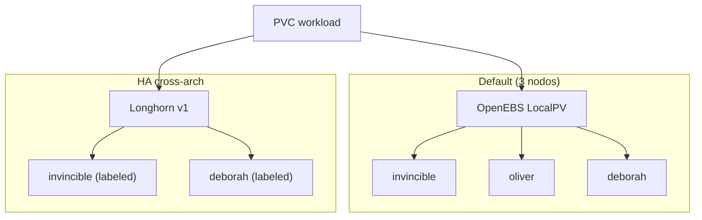

# Storage

!!! info "Parte de la guía de implementación"
    Desplegado en **[Fase 4 — GitOps](../implementacion/fase-4-gitops.md)** (waves 0–1).
    Etiquetas Longhorn: **[Fase 3 — K3s](../implementacion/fase-3-k3s.md)**.

Híbrido x86_64 + ARM64 (arquitectura ARM de 64 bits) — manifiestos GitOps en [`gitops/storage/`](https://github.com/symintel/gitops/tree/main/storage).

## Diagrama — tiers de storage



- **[OpenEBS](https://openebs.io/docs)** — LocalPV default; 3 nodos; sin replicación.
- **[Longhorn](https://longhorn.io/docs/)** — Replicado x86↔arm64; solo invincible + deborah.

## OpenEBS LocalPV (default)

DaemonSet en los 3 nodos. StorageClass por defecto para casi todo.

Desplegado vía Argo CD Application `openebs` (Helm).

## Longhorn v1 (HA selectiva, cross-arch)

**Usar siempre el motor v1 (default), nunca v2/SPDK**: v2 tiene un bug
documentado de I/O bloqueado en ARM64 con NVMe (disco SSD por PCIe) + 2 núcleos.

```bash
kubectl label node invincible node.longhorn.io/create-default-disk=true
kubectl label node deborah node.longhorn.io/create-default-disk=true
kubectl label node oliver node.longhorn.io/create-default-disk=false
```

Con `numberOfReplicas: "2"` y 2 nodos elegibles (x86 + arm64), cada volumen
queda replicado entre arquitecturas.

<div class="card">
  <div class="card-kicker">Análisis de trade-offs</div>
  <div class="option-grid">
    <div class="card-col">
      <div class="card-title">OpenEBS LocalPV <span class="tag tag-accent">elegida</span></div>
      <div class="text-muted">Simple en 3 nodos; default para casi todo</div>
      <div class="text-muted">Sin HA si cae el nodo del pod</div>
    </div>
    <div class="card-col">
      <div class="card-title">Longhorn v1</div>
      <div class="text-muted">Réplica x86↔arm64; UI de volúmenes</div>
      <div class="text-muted">Solo 2 nodos elegibles; más RAM/pods</div>
    </div>
    <div class="card-col">
      <div class="card-title">Solo OpenEBS</div>
      <div class="text-muted">Menor superficie operativa</div>
      <div class="text-muted">PVC críticos sin réplica cross-node</div>
    </div>
    <div class="card-col">
      <div class="card-title">Mayastor <span class="tag tag-neutral">descartado</span></div>
      <div class="text-muted">Alto rendimiento NVMe</div>
      <div class="text-muted">≥2 GiB hugepages — inviable en M700</div>
    </div>
  </div>
</div>

## StorageClasses del clúster

Una StorageClass (clase de almacenamiento) le dice a Kubernetes **cómo** crear el
volumen de un PVC (PersistentVolumeClaim, pedido de almacenamiento). Estas son las que hay hoy
(`kubectl get storageclass`); las de `gitops/storage/` las crea la Application
`homelab-storage`, el resto las traen los charts o K3s.

| StorageClass | Quién la crea | Aprovisionador | Réplicas | Binding | Se puede ampliar | ¿Default? |
|---|---|---|---|---|---|---|
| `openebs-hostpath` | [`gitops/storage/openebs-local.yaml`](https://github.com/symintel/gitops/blob/main/storage/openebs-local.yaml) | OpenEBS LocalPV (`openebs.io/local`) | 1 (disco del nodo) | `WaitForFirstConsumer` | No | **Sí** |
| `local-path` | K3s (addon `local-storage`) | `rancher.io/local-path` | 1 (disco del nodo) | `WaitForFirstConsumer` | No | **Sí** (ver aviso) |
| `longhorn` | chart de Longhorn | Longhorn (`driver.longhorn.io`) | `defaultClassReplicaCount` (2 en [`longhorn.yaml`](https://github.com/symintel/gitops/blob/main/argocd/apps/longhorn.yaml)) | `Immediate` | Sí | No |
| `longhorn-mixto` | [`gitops/storage/storageclasses.yaml`](https://github.com/symintel/gitops/blob/main/storage/storageclasses.yaml) | Longhorn | 2 fijas | `Immediate` | Sí | No |
| `longhorn-static` | chart de Longhorn | Longhorn | — (sin parámetros) | `Immediate` | Sí | No |

Todas tienen `reclaimPolicy: Delete`: **al borrar el PVC se borra el volumen y sus datos**.

!!! warning "Hoy hay dos StorageClass por defecto"
    `openebs-hostpath` y `local-path` llevan la anotación `is-default-class`. Con dos
    defaults, un PVC sin `storageClassName` queda ambiguo: Kubernetes usa la creada más recientemente y el resultado depende del
    orden en que se instaló cada una.
    Lo recomendable es dejar solo una: quitar el addon `local-storage` de K3s
    (`k3s_install.core.disable_components` en Ansible, junto a `traefik` y `servicelb`) y,
    mientras tanto, pedir siempre la clase explícita en los PVC.

### `openebs-hostpath` — local, rápida, atada al nodo

Crea una carpeta en el disco del nodo donde corre el pod.

| A favor | En contra |
|---|---|
| La más rápida: disco local, sin red ni réplicas | **Sin replicación**: si el nodo cae, los datos no están disponibles hasta que vuelva |
| Casi sin consumo de RAM/CPU; funciona igual en x86_64 y ARM64 | El pod queda **atado al nodo** donde nació el volumen: no puede reprogramarse en otro |
| Funciona en los 3 nodos, sin preparar discos ni paquetes | No se puede ampliar, no hay snapshots ni cuotas (el pod puede llenar el disco del nodo) |
| Con `WaitForFirstConsumer` el volumen nace donde el scheduler (planificador) ubica el pod | Solo `ReadWriteOnce` (un solo nodo a la vez) |

**Úsala para:** cachés, datos reconstruibles, bases de datos de pruebas, todo lo que se
pueda perder sin dolor.

### `local-path` — la de K3s

Mismo modelo que `openebs-hostpath` (carpeta local, sin réplicas, atada al nodo), pero
viene con K3s. Hoy duplica a la anterior: ver el aviso de arriba. No la uses en
manifiestos nuevos.

### `longhorn` y `longhorn-mixto` — replicadas

Longhorn guarda cada volumen como bloque replicado en varios nodos, con snapshots,
backups y una UI.

| A favor | En contra |
|---|---|
| **Sobrevive a la caída de un nodo**: las réplicas viven en nodos distintos (x86_64 y ARM64) | Escribir es más lento: cada escritura se confirma en todas las réplicas **por red** |
| Se puede ampliar en caliente (`allowVolumeExpansion`), con snapshots y backups | Consume **RAM y CPU** extra en cada nodo (managers, instance managers) y espacio: con 2 réplicas, 2× el tamaño |
| `ReadWriteMany` (varios pods a la vez) mediante un servidor NFS por volumen | Exige `open-iscsi` y `nfs-common` en los nodos (rol `k3s_prereqs`) |
| UI para ver el estado de cada volumen | Con `Immediate` las réplicas se programan **sin saber** dónde correrá el pod, así que puede leer por red |

**Cuál de las dos:**

- `longhorn`: sus réplicas salen del valor del chart (`defaultClassReplicaCount`). Si
  alguien cambia el chart, cambia el comportamiento de los PVC **nuevos**. Es la que usa
  hoy `arc-cache` (la [caché de los runners](../operacion/cache-arc.md)).
- `longhorn-mixto`: **2 réplicas fijas**, `dataLocality: disabled` (la réplica no se pega
  al nodo del pod: más tolerante a fallos, más tráfico de red) y `staleReplicaTimeout: 30`
  (minutos hasta descartar una réplica desactualizada). Úsala cuando quieras un número de
  réplicas que no dependa del chart.

**Úsalas para:** datos que importan (bases de datos, estado de aplicaciones) y volúmenes
compartidos.

!!! note "Los parámetros de una StorageClass no se editan"
    Kubernetes no permite cambiar los `parameters` de una StorageClass existente. Para
    cambiar réplicas hay que **borrar y recrear la clase** (los PVC que ya existen no
    cambian). Hoy `kubectl get storageclass longhorn` puede mostrar `numberOfReplicas: "3"`
    aunque `longhorn.yaml` pida 2, si la clase se creó antes del cambio; con 3 réplicas y
    pocos nodos elegibles los volúmenes quedan degradados.

!!! note "¿En cuántos nodos vive Longhorn?"
    Las etiquetas `node.longhorn.io/create-default-disk` de arriba solo se respetan si el
    ajuste `createDefaultDiskLabeledNodes` está en `true`. Hoy está en `false` (verificado
    con `kubectl -n longhorn-system get settings.longhorn.io`), así que **los tres nodos**
    aportan disco, `oliver` incluido. Para limitarlo a `invincible` y `deborah`, activa ese
    ajuste en `defaultSettings` de `longhorn.yaml` y desactiva el disco de `oliver` en la UI.

### `longhorn-static` — solo para volúmenes ya creados

Clase sin parámetros que crea el chart para **enlazar** a mano un volumen que ya existe
en Longhorn (provisión estática). No crea volúmenes nuevos por sí sola: no la uses en un
PVC normal.

### Binding: `WaitForFirstConsumer` o `Immediate`

| Modo | Qué hace | Trade-off |
|---|---|---|
| `WaitForFirstConsumer` (las dos locales) | Espera a que el pod sea programado y crea el volumen **en ese nodo** | El volumen siempre queda junto al pod; después queda atado a ese nodo |
| `Immediate` (las de Longhorn) | Crea el volumen apenas existe el PVC | Funciona sin pod, pero las réplicas se eligen sin conocer el nodo del pod |

### ¿Cuál elijo?

| Necesito… | Usa |
|---|---|
| Datos que **no** puedo perder, o que el pod pueda moverse de nodo | `longhorn-mixto` |
| Lo más rápido posible y los datos son reconstruibles | `openebs-hostpath` |
| Un volumen que usen varios pods a la vez (`ReadWriteMany`) | `longhorn` o `longhorn-mixto` |
| Crecer un volumen sin recrearlo | `longhorn` o `longhorn-mixto` |
| Que borrar el PVC **no** borre los datos | Ninguna: todas son `Delete`; crea una clase con `reclaimPolicy: Retain` |

Para pedir una clase, ponla en el PVC:

```yaml
spec:
  storageClassName: longhorn-mixto
  accessModes: [ReadWriteOnce]
  resources:
    requests:
      storage: 10Gi
```

## Por qué no Mayastor

Mayastor exige ≥2 GiB de hugepages fijos — descartado para el M700.

Guía ejecutable: **[Fase 4 — GitOps](../implementacion/fase-4-gitops.md)**.
