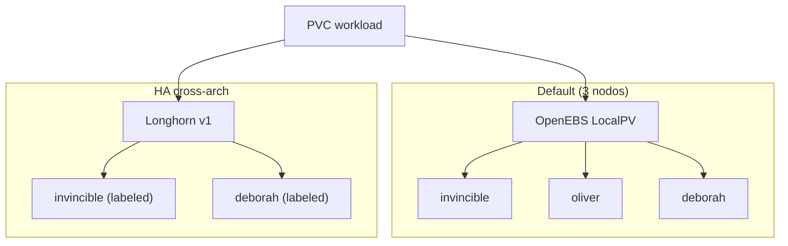

# Storage

!!! info "Parte de la guía de implementación"
    Desplegado en **[Fase 4 — GitOps](../implementacion/fase-4-gitops.md)** (waves 0–1).
    Etiquetas Longhorn: **[Fase 3 — K3s](../implementacion/fase-3-k3s.md)**.

Híbrido x86_64 + ARM64 (arquitectura ARM de 64 bits) — manifiestos GitOps en [`gitops/storage/`](https://github.com/symintel/gitops/tree/main/storage).

## Diagrama — tiers de storage



- **[OpenEBS](https://openebs.io/docs)** — LocalPV default; 3 nodos; sin replicación.
- **[Longhorn](https://longhorn.io/docs/)** — Replicado x86↔arm64; solo invincible + deborah.

## OpenEBS LocalPV (default)

DaemonSet en los 3 nodos. StorageClass por defecto para casi todo.

Desplegado vía Argo CD Application `openebs` (Helm).

## Longhorn v1 (HA selectiva, cross-arch)

**Usar siempre el motor v1 (default), nunca v2/SPDK**: v2 tiene un bug
documentado de I/O bloqueado en ARM64 con NVMe (disco SSD por PCIe) + 2 núcleos.

```bash
kubectl label node invincible node.longhorn.io/create-default-disk=true
kubectl label node deborah node.longhorn.io/create-default-disk=true
kubectl label node oliver node.longhorn.io/create-default-disk=false
```

Con `numberOfReplicas: "2"` y 2 nodos elegibles (x86 + arm64), cada volumen
queda replicado entre arquitecturas.

<div class="card">
  <div class="card-kicker">Análisis de trade-offs</div>
  <div class="option-grid">
    <div class="card-col">
      <div class="card-title">OpenEBS LocalPV <span class="tag tag-accent">elegida</span></div>
      <div class="text-muted">Simple en 3 nodos; default para casi todo</div>
      <div class="text-muted">Sin HA si cae el nodo del pod</div>
    </div>
    <div class="card-col">
      <div class="card-title">Longhorn v1</div>
      <div class="text-muted">Réplica x86↔arm64; UI de volúmenes</div>
      <div class="text-muted">Solo 2 nodos elegibles; más RAM/pods</div>
    </div>
    <div class="card-col">
      <div class="card-title">Solo OpenEBS</div>
      <div class="text-muted">Menor superficie operativa</div>
      <div class="text-muted">PVC críticos sin réplica cross-node</div>
    </div>
    <div class="card-col">
      <div class="card-title">Mayastor <span class="tag tag-neutral">descartado</span></div>
      <div class="text-muted">Alto rendimiento NVMe</div>
      <div class="text-muted">≥2 GiB hugepages — inviable en M700</div>
    </div>
  </div>
</div>

## Por qué no Mayastor

Mayastor exige ≥2 GiB de hugepages fijos — descartado para el M700.

Guía ejecutable: **[Fase 4 — GitOps](../implementacion/fase-4-gitops.md)**.
