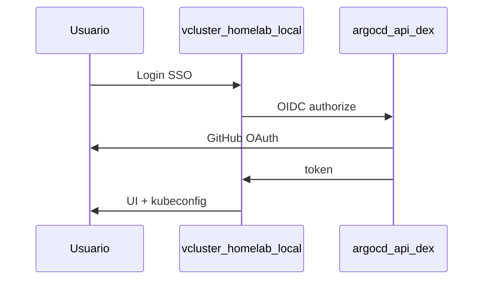

# vCluster Platform

!!! info "Parte de la guía de implementación"
    **[Fase 5 — vCluster](../implementacion/fase-5-vcluster.md)** — pasos ejecutables.
    Requiere **[Fase 4 — GitOps](../implementacion/fase-4-gitops.md)** (Dex, Ingress).

Complemento de profundización. vCluster Platform ofrece **UI (interfaz de usuario) web**, **SSO (inicio de sesión único) vía
Dex de ArgoCD** y **descarga de kubeconfig** del management K3s (connected
cluster) y de vclusters, sin depender solo de CLI (interfaz de línea de comandos).

## Para qué sirve

| Capacidad | Descripción |
|---|---|
| Clústeres virtuales | API Kubernetes aislada dentro del management K3s, sin levantar VMs Incus |
| UI web | Crear/borrar vclusters, ver estado, conectar desde navegador |
| SSO | Login OIDC vía **Dex** → **GitHub** (team `devops` de la org `symintel`); credenciales en 1Password |
| Kubeconfig | **Download kubeconfig** / **Connect** para el **host K3s** (connected cluster) y para cada **vCluster** |

Sync **manual** — Application `vcluster-platform` (comentada en el ApplicationSet `homelab-root`: se activa a mano).

## Componentes involucrados

| Recurso | Para qué sirve |
|---|---|
| [`vcluster-platform.yaml`](https://github.com/symintel/gitops/blob/main/argocd/apps/vcluster-platform.yaml) | Application Helm que instala Loft Platform en `vcluster-platform` |
| [`vcluster/values/platform.yaml`](https://github.com/symintel/gitops/blob/main/vcluster/values/platform.yaml) | Host `vcluster.homelab.local`, OIDC issuer → ArgoCD Dex |
| [`argocd/config/dex.config`](https://github.com/symintel/gitops/blob/main/argocd/config/dex.config) | Connector GitHub + OAuth client `vcluster-platform` |
| [`argocd/secrets/1password.md`](https://github.com/symintel/gitops/blob/main/argocd/secrets/1password.md) | Ítems 1Password → `argocd-secret` |
| **`argocd-ingress`** | Publica ArgoCD/Dex en `argocd.homelab.local` (ver [GitOps](../gitops/index.md)) |

## Flujo de autenticación



| URL | Rol |
|---|---|
| `https://argocd.homelab.local` | ArgoCD UI; Dex issuer en `/api/dex` |
| `https://vcluster.homelab.local` | vCluster Platform UI |

## Implementación (resumen)

Sigue la **[Fase 4 — GitOps](../implementacion/fase-4-gitops.md)** hasta
completar OAuth Dex e Ingress. Luego:

### 1. Secretos OAuth (paso 4.7 de la guía GitOps)

Ansible genera y aplica los secretos locales; en 1Password solo necesitas
crear manualmente `GITHUB_CLIENT_ID` y `GITHUB_CLIENT_SECRET`:

```bash
cd ansible
ansible-playbook -i inventory.ini playbook-dex-oauth-secrets.yml
# Tras desplegar Platform (paso 2):
ansible-playbook -i inventory.ini playbook-dex-oauth-secrets.yml \
  --tags vcluster -e dex_oauth.apply_vcluster=true
```

### 2. Desplegar Platform

```bash
kubectl apply -f gitops/argocd/apps/vcluster-platform.yaml
```

ArgoCD UI → `vcluster-platform` → **Sync**.

### 3. Validar SSO GitHub

Tras sync de `argocd-config`, login en ArgoCD o Platform debe ofrecer **GitHub**.
Si falla, revisa el Redirect URIs de la OAuth App y el team `symintel/devops` en
[`dex.config`](https://github.com/symintel/gitops/blob/main/argocd/config/dex.config).

Con SSO estable, pon `auth.password.disabled: true` en `platform.yaml`.

### 4. /etc/hosts

```
<IP-del-Ingress>  argocd.homelab.local vcluster.homelab.local
192.168.20.6      incus.homelab.local
```

`<IP-del-Ingress>` es la EXTERNAL-IP que MetalLB le da al Ingress NGINX;
`incus` apunta siempre a invincible. Obtén la IP del Ingress:

```bash
kubectl get svc -n ingress-nginx ingress-nginx-controller \
  -o jsonpath='{.status.loadBalancer.ingress[0].ip}'; echo
```

## Uso diario

1. Abre `https://vcluster.homelab.local`
2. **Login with SSO** (GitHub) o admin local hasta deshabilitar password
3. **New Virtual Cluster** → nombre → **Create**
4. En el vcluster: **Connect** / **Download kubeconfig**
5. `export KUBECONFIG=~/Downloads/kubeconfig.yaml` y `kubectl get nodes`

### Kubeconfig del management K3s (connected cluster)

El clúster host donde corre Platform aparece en **Clusters** como connected
cluster. Mismo flujo SSO → **Connect** / **Download kubeconfig**. Sin **Cluster
Access** explícito, el usuario autenticado **no ve el clúster** (denegar por
defecto). Asigna permisos al usuario/equipo `loft-*` en la UI de Platform.

Alternativa sin web: [`fase-4-gitops.md` 4.1](../implementacion/fase-4-gitops.md#41-acceso-kubectl).

CLI alternativa:

```bash
vcluster connect <nombre> -n <namespace>
```

## vCluster vs CAPN

| | vCluster Platform | CAPN |
|---|---|---|
| Auth | Dex ArgoCD + UI kubeconfig | Secret Incus sellado |
| Runtime | Pods en management K3s | Instancias Incus |
| RAM | Moderada (1 vcluster) | Alta por nodo kubeadm |
| Sync ArgoCD | manual | manual |

<div class="card">
  <div class="card-kicker">vCluster vs CAPN</div>
  <div class="option-grid">
    <div class="card-col">
      <div class="card-title">vCluster Platform</div>
      <div class="text-muted">Pods en K3s; kubeconfig web; SSO Dex</div>
      <div class="text-muted">Overhead por vcluster; permisos Platform</div>
    </div>
    <div class="card-col">
      <div class="card-title">CAPN</div>
      <div class="text-muted">Clusters kubeadm reales en Incus</div>
      <div class="text-muted">Mucha RAM por nodo; secret Incus sellado</div>
    </div>
    <div class="card-col">
      <div class="card-title">Kubeconfig web (Platform)</div>
      <div class="text-muted">Sin <code>scp</code>; audit centralizado</div>
      <div class="text-muted">Requiere Cluster Access explícito</div>
    </div>
    <div class="card-col">
      <div class="card-title"><code>scp</code> / CLI</div>
      <div class="text-muted">Funciona antes de Fase 5</div>
      <div class="text-muted">Archivo local; sin SSO en el flujo</div>
    </div>
  </div>
</div>

## Dependencias

Deben estar **Healthy** antes de sync Platform:

- `openebs`, `homelab-storage` (PVCs)
- `metallb`, `metallb-config`, `ingress-nginx` (URLs HTTPS)
- `argocd-ingress`, `argocd-config` (Dex + staticClient)
